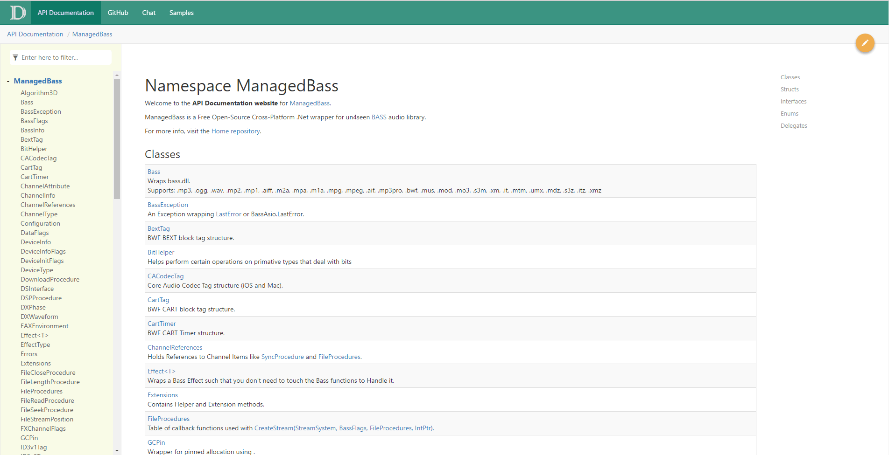
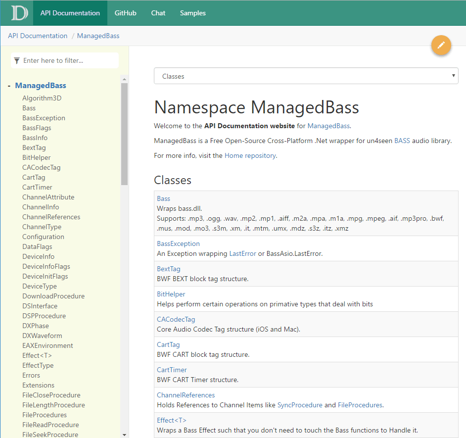
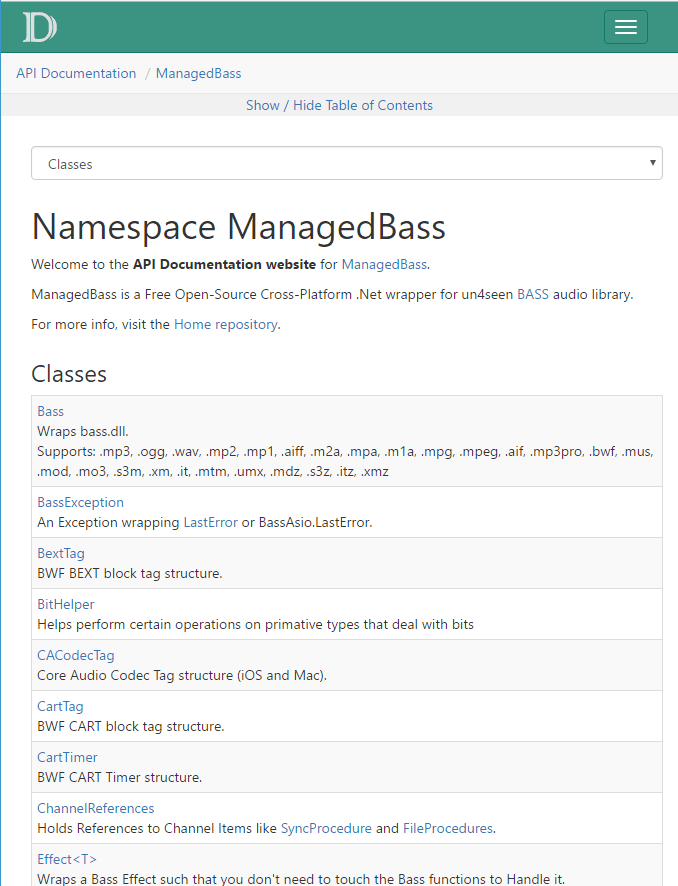
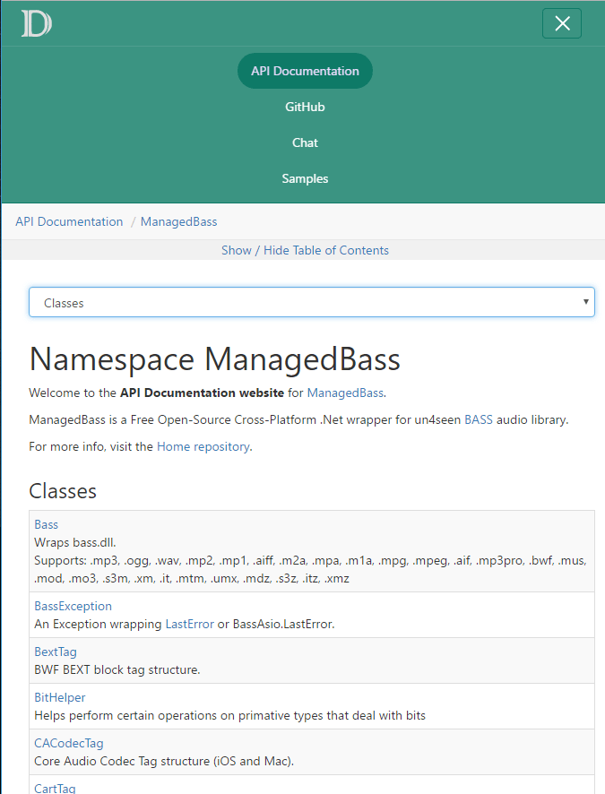

# docfx-tmpl
A DocFX Template patching the Default template.

Supported DocFX version: [v2.17.4](https://github.com/dotnet/docfx/releases/tag/v2.17.4)

## Changes from Default Template
- Full Width (uses container-fluid instead of container).
- Affix sidebar styled like Bootstrap Documentation.
- Thinner TOC toggle button on mobiles.
- Hides the **IN THIS ARTICLE** heading above sidebar.
- Tabular views for Namespace.
- Pretty tables for Class view.
- Collapsible sections in API documentation.
- Round Buttons for View-Source and Edit.
- Different colors.

## How to use
The template is contained in the source folder.

**Clone or Download**  
In a terminal, run: `git clone https://github.com/MathewSachin/docfx-tmpl.git`

**Apply Template**  
Use `default, <relative path to src folder of this template>`

In docfx.json (showing only relevant portion):

```json
{
    "build": {
        "template": [
            "default",
            "docfx-tmpl/src"
        ]
    }
}
```

**OR**

In Command-line:

```
docfx -t default,docfx-tmpl/src
```

## ScreenShots






