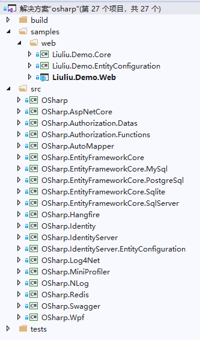
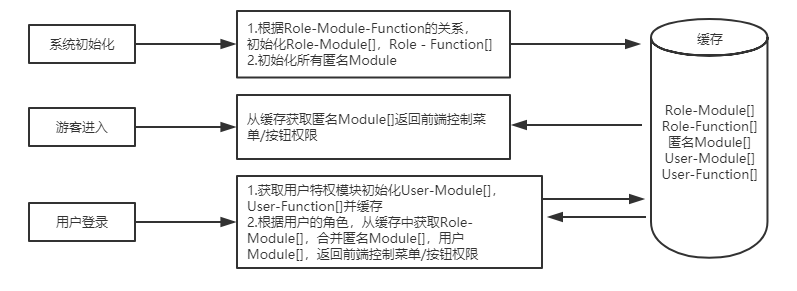
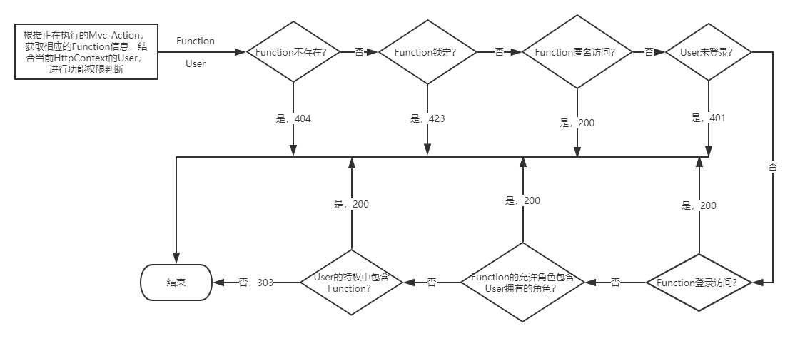
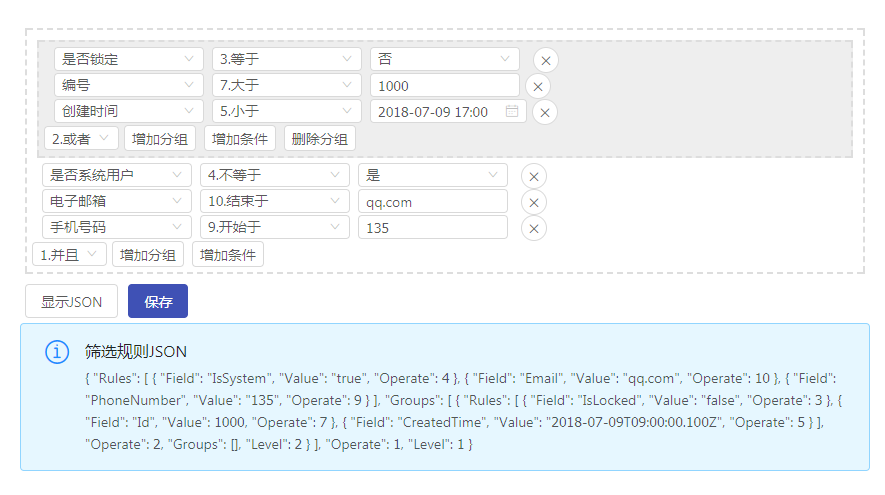

# OSharp简介
---
## 什么是OSharp
OSharp 全称 OSharp Framework with .NetStandard2.x，是一个基于`.NetStandard2.x`开发的一个`.NetCore`快速开发框架。这个框架使用最新稳定版的`.NetCore SDK`（当前是.NET Core 3.0），对 AspNetCore 的配置、依赖注入、日志、缓存、实体框架、Mvc(WebApi)、身份认证、权限授权等模块进行更高一级的自动化封装，并规范了一套业务实现的代码结构与操作流程，使 .Net Core 框架更易于应用到实际项目开发中。

## 框架工程组织

框架的工程组织结构如下：

{.img-fluid tag=1}

### 各工程简介

> + **OSharp**【框架核心组件】：框架的核心组件，包含一系列快速开发中经常用到的Utility辅助工具功能，框架各个组件的核心接口定义，部分核心功能的实现
> + **OSharp.AspNetCore**【AspNetCore组件】：AspNetCore组件，提供AspNetCore的服务端功能的封装
> + **OSharp.Authorization.Datas** 【OSharp 数据权限组件】：OSharp 数据权限组件，对应用中数据权限进行授权的设计实现
> + **OSharp.Authorization.Functions**【OSharp 功能权限组件】：OSharp 功能权限组件，API功能权限授权的设计实现
> + **OSharp.AutoMapper**【对象映射组件】：AutoMapper 对象映射组件，封装基于AutoMapper的对象映射实现
> + **OSharp.EntityFrameworkCore**【EFCore 数据组件】：EFCore数据访问组件，封装EntityFrameworkCore数据访问功能的实现
> + **OSharp.EntityFrameworkCore.MySql**【EFCore MySql 数据组件】：EFCore MySql数据访问组件，封装MySql的EntityFrameworkCore数据访问功能的实现
> + **OSharp.EntityFrameworkCore.SqlServer**【EFCore SqlServer 数据组件】：EFCore SqlServer数据访问组件，封装SqlServer的EntityFrameworkCore数据访问功能的实现
> + **OSharp.EntityFrameworkCore.Sqlite**【EFCore Sqlite 数据组件】：EFCore Sqlite数据访问组件，封装Sqlite的EntityFrameworkCore数据访问功能的实现
> + **OSharp.EntityFrameworkCore.PostgreSql**【EFCore PostgreSql 数据组件】：EFCore PostgreSql数据访问组件，封装PostgreSql的EntityFrameworkCore数据访问功能的实现
> + **OSharp.EntityFrameworkCore.Oracle**【EFCore PostgreSql 数据组件】：EFCore Oracle数据访问组件，封装Oracle的EntityFrameworkCore数据访问功能的实现
> + **OSharp.Hangfire**【后台任务组件】：封装基于Hangfire后台任务的服务端实现
> + **OSharp.Identity**【身份认证组件】：使用AspNetCore的Identity为基础实现身份认证的封装
> + **OSharp.IdentityServer**【OSharp IdentityServer组件】:OSharp IdentityServer组件，基于IdentityServer4提供身份认证与客户端授权的实现
> + **OSharp.IdentityServer.EntityConfiguration**【OSharp IdentityServer EFCore存储配置组件】:OSharp IdentityServer EFCore存储配置组件，对IdentityServer4的存储进行EFCore映射配置
> + **OSharp.Log4Net**【日志组件】：基于Log4Net的日志记录组件
> + **OSharp.MiniProfiler**【MiniProfiler组件】：基于MiniProfiler实现的性能监测组件
> + **OSharp.NLog**【OSharp NLog组件】:OSharp NLog组件，封装使用nlog组件来实现框架的日志输出功能
> + **OSharp.Redis**【缓存组件】：基于Redis的分布式缓存客户端组件
> + **OSharp.Swagger**【SwaggerAPI组件】：基于Swagger生成MVC的Action的API测试接口信息
> + **OSharp.Wpf**【OSharp Wpf 客户端组件】：OSharp Wpf 客户端组件，封装Wpf客户端的辅助操作


### Nuget Packages

|包名称|稳定版本|预览版本|下载数|
|----|----|----|----|
|[OSharp.Core](https://www.nuget.org/packages/OSharp.Core/)|[](https://www.nuget.org/packages/OSharp.Core/)|[](https://www.nuget.org/packages/OSharp.Core/)|[](https://www.nuget.org/packages/OSharp.Core/)|
|[OSharp.AspNetCore](https://www.nuget.org/packages/OSharp.AspNetCore/)|[](https://www.nuget.org/packages/OSharp.AspNetCore/)|[](https://www.nuget.org/packages/OSharp.AspNetCore/)|[](https://www.nuget.org/packages/OSharp.AspNetCore/)|
|[OSharp.Authorization.Datas](https://www.nuget.org/packages/OSharp.Authorization.Datas/)|[](https://www.nuget.org/packages/OSharp.Authorization.Datas/)|[](https://www.nuget.org/packages/OSharp.Authorization.Datas/)|[](https://www.nuget.org/packages/OSharp.Authorization.Datas/)|
|[OSharp.Authorization.Functions](https://www.nuget.org/packages/OSharp.Authorization.Functions/)|[](https://www.nuget.org/packages/OSharp.Authorization.Functions/)|[](https://www.nuget.org/packages/OSharp.Authorization.Functions/)|[](https://www.nuget.org/packages/OSharp.Authorization.Functions/)|
|[OSharp.AutoMapper](https://www.nuget.org/packages/OSharp.AutoMapper/)|[](https://www.nuget.org/packages/OSharp.AutoMapper/)|[](https://www.nuget.org/packages/OSharp.AutoMapper/)|[](https://www.nuget.org/packages/OSharp.AutoMapper/)|
|[OSharp.EntityFrameworkCore](https://www.nuget.org/packages/OSharp.EntityFrameworkCore/)|[](https://www.nuget.org/packages/OSharp.EntityFrameworkCore/)|[](https://www.nuget.org/packages/OSharp.EntityFrameworkCore/)|[](https://www.nuget.org/packages/OSharp.EntityFrameworkCore/)|
|[OSharp.EntityFrameworkCore.SqlServer](https://www.nuget.org/packages/OSharp.EntityFrameworkCore.SqlServer/)|[](https://www.nuget.org/packages/OSharp.EntityFrameworkCore.SqlServer/)|[](https://www.nuget.org/packages/OSharp.EntityFrameworkCore.SqlServer/)|[](https://www.nuget.org/packages/OSharp.EntityFrameworkCore.SqlServer/)|
|[OSharp.EntityFrameworkCore.MySql](https://www.nuget.org/packages/OSharp.EntityFrameworkCore.MySql/)|[](https://www.nuget.org/packages/OSharp.EntityFrameworkCore.MySql/)|[](https://www.nuget.org/packages/OSharp.EntityFrameworkCore.MySql/)|[](https://www.nuget.org/packages/OSharp.EntityFrameworkCore.MySql/)|
|[OSharp.EntityFrameworkCore.Sqlite](https://www.nuget.org/packages/OSharp.EntityFrameworkCore.Sqlite/)|[](https://www.nuget.org/packages/OSharp.EntityFrameworkCore.Sqlite/)|[](https://www.nuget.org/packages/OSharp.EntityFrameworkCore.Sqlite/)|[](https://www.nuget.org/packages/OSharp.EntityFrameworkCore.Sqlite/)|
|[OSharp.EntityFrameworkCore.PostgreSql](https://www.nuget.org/packages/OSharp.EntityFrameworkCore.PostgreSql/)|[](https://www.nuget.org/packages/OSharp.EntityFrameworkCore.PostgreSql/)|[](https://www.nuget.org/packages/OSharp.EntityFrameworkCore.PostgreSql/)|[](https://www.nuget.org/packages/OSharp.EntityFrameworkCore.PostgreSql/)|
|[OSharp.Hangfire](https://www.nuget.org/packages/OSharp.Hangfire/)|[](https://www.nuget.org/packages/OSharp.Hangfire/)|[](https://www.nuget.org/packages/OSharp.Hangfire/)|[](https://www.nuget.org/packages/OSharp.Hangfire/)||[OSharp.Identity](https://www.nuget.org/packages/OSharp.Identity/)|[](https://www.nuget.org/packages/OSharp.Identity/)|
|[OSharp.Identity](https://www.nuget.org/packages/OSharp.Identity/)|[](https://www.nuget.org/packages/OSharp.Identity/)|[](https://www.nuget.org/packages/OSharp.Identity/)|[](https://www.nuget.org/packages/OSharp.Identity/)|
|[OSharp.IdentityServer](https://www.nuget.org/packages/OSharp.IdentityServer/)|[](https://www.nuget.org/packages/OSharp.IdentityServer/)|[](https://www.nuget.org/packages/OSharp.IdentityServer/)|[](https://www.nuget.org/packages/OSharp.IdentityServer/)|
|[OSharp.IdentityServer.EntityConfiguration](https://www.nuget.org/packages/OSharp.IdentityServer.EntityConfiguration/)|[](https://www.nuget.org/packages/OSharp.IdentityServer.EntityConfiguration/)|[](https://www.nuget.org/packages/OSharp.IdentityServer.EntityConfiguration/)|[](https://www.nuget.org/packages/OSharp.IdentityServer.EntityConfiguration/)|
|[OSharp.Log4Net](https://www.nuget.org/packages/OSharp.Log4Net/)|[](https://www.nuget.org/packages/OSharp.Log4Net/)|[](https://www.nuget.org/packages/OSharp.Log4Net/)|[](https://www.nuget.org/packages/OSharp.Log4Net/)|
|[OSharp.MiniProfiler](https://www.nuget.org/packages/OSharp.MiniProfiler/)|[](https://www.nuget.org/packages/OSharp.MiniProfiler/)|[](https://www.nuget.org/packages/OSharp.MiniProfiler/)|[](https://www.nuget.org/packages/OSharp.MiniProfiler/)|
|[OSharp.Redis](https://www.nuget.org/packages/OSharp.Redis/)|[](https://www.nuget.org/packages/OSharp.Redis/)|[](https://www.nuget.org/packages/OSharp.Redis/)|[](https://www.nuget.org/packages/OSharp.Redis/)|
|[OSharp.Exceptionless](https://www.nuget.org/packages/OSharp.Exceptionless/)|[](https://www.nuget.org/packages/OSharp.Exceptionless/)|[](https://www.nuget.org/packages/OSharp.Exceptionless/)|[](https://www.nuget.org/packages/OSharp.Exceptionless/)|
|[OSharp.Swagger](https://www.nuget.org/packages/OSharp.Swagger/)|[](https://www.nuget.org/packages/OSharp.Swagger/)|[](https://www.nuget.org/packages/OSharp.Swagger/)|[](https://www.nuget.org/packages/OSharp.Swagger/)|
|[OSharp.Wpf](https://www.nuget.org/packages/OSharp.Wpf/)|[](https://www.nuget.org/packages/OSharp.Wpf/)|[](https://www.nuget.org/packages/OSharp.Wpf/)|[](https://www.nuget.org/packages/OSharp.Wpf/)|
|[OSharp.Hosting.Core](https://www.nuget.org/packages/OSharp.Hosting.Core/)|[](https://www.nuget.org/packages/OSharp.Hosting.Core/)|[](https://www.nuget.org/packages/OSharp.Hosting.Core/)|[](https://www.nuget.org/packages/OSharp.Hosting.Core/)|
|[OSharp.Hosting.EntityConfiguration](https://www.nuget.org/packages/OSharp.Hosting.EntityConfiguration/)|[](https://www.nuget.org/packages/OSharp.Hosting.EntityConfiguration/)|[](https://www.nuget.org/packages/OSharp.Hosting.EntityConfiguration/)|[](https://www.nuget.org/packages/OSharp.Hosting.EntityConfiguration/)|
|[OSharp.Hosting.Apis](https://www.nuget.org/packages/OSharp.Hosting.Apis/)|[](https://www.nuget.org/packages/OSharp.Hosting.Apis/)|[](https://www.nuget.org/packages/OSharp.Hosting.Apis/)|[](https://www.nuget.org/packages/OSharp.Hosting.Apis/)|
|[OSharpNS](https://www.nuget.org/packages/OSharpNS/)|[](https://www.nuget.org/packages/OSharpNS/)|[](https://www.nuget.org/packages/OSharpNS/)|[](https://www.nuget.org/packages/OSharpNS/)|
|[OSharp.Template.WebApi](https://www.nuget.org/packages/OSharp.Template.WebApi/)|[](https://www.nuget.org/packages/OSharp.Template.WebApi/)|[](https://www.nuget.org/packages/OSharp.Template.WebApi/)|                                                          |

## OSharp框架特性

### 1. 模块化的组件系统设计
OSharp框架设计了一个模块（[Pack](https://docs.osharp.org/api/OSharp.Core.Packs.html)）系统，每个Pack以一个实现了模块基类（[OsharpPack](https://docs.osharp.org/api/OSharp.Core.Packs.OsharpPack.html)）的类作为入口，这个类完成本模块的服务添加（AddService）和模块初始化工作（UserPack）。一个Pack是一系列高内聚低耦合的服务组织，对象提供一个功能（如缓存功能，日志功能，数据存储功能）或完成一组业务处理（如身份认证，权限授权）。

一个Pack入口类的代码如下：
``` csharp
public class XXXPack : OsharpPack
{
    /// <summary>
    /// 获取 模块级别
    /// </summary>
    public override PackLevel Level => PackLevel.Core;

    /// <summary>
    /// 获取 模块启动顺序，模块启动的顺序先按级别启动，级别内部再按此顺序启动
    /// </summary>
    public override int Order => 2;

    /// <summary>
    /// 将模块服务添加到依赖注入服务容器中
    /// </summary>
    /// <param name="services">依赖注入服务容器</param>
    /// <returns></returns>
    public override IServiceCollection AddServices(IServiceCollection services)
    {
        // TODO: 在这里添加本模块涉及的各种依赖注入服务

        return services;
    }

    /// <summary>
    /// 应用模块服务
    /// </summary>
    /// <param name="provider">服务提供者</param>
    public override void UsePack(IServiceProvider provider)
    {
        // TODO: 在这里进行模块的初始化操作

        IsEnabled = true;
    }
}
```

当前框架的模块组成如下图：

| 名称                               | 类型                                                            | 级别        |
|----------------------------------|-----------------------------------------------------------------|-------------|
| OSharp核心模块                     | OSharp.Core.Packs.OsharpCorePack                                | Core        |
| 依赖注入模块                       | OSharp.Dependency.DependencyPack                                | Core        |
| Log4Net模块                        | OSharp.Log4Net.Log4NetPack                                      | Core        |
| AspNetCore模块                     | OSharp.AspNetCore.AspNetCorePack                                | Core        |
| 事件总线模块                       | OSharp.EventBuses.EventBusPack                                  | Core        |
| AutoMapper模块                     | OSharp.AutoMapper.AutoMapperPack                                | Framework   |
| Hangfire后台任务模块               | OSharp.Hangfire.HangfirePack                                    | Framework   |
| Redis模块                          | OSharp.Redis.RedisPack                                          | Framework   |
| MySqlEntityFrameworkCore模块       | OSharp.Entity.MySql.MySqlEntityFrameworkCorePack                | Framework   |
| SqliteEntityFrameworkCore模块      | OSharp.Entity.Sqlite.SqliteEntityFrameworkCorePack              | Framework   |
| SqlServerEntityFrameworkCore模块   | OSharp.Entity.SqlServer.SqlServerEntityFrameworkCorePack        | Framework   |
| SqlServer-DefaultDbContext迁移模块 | OSharp.Site.Web.Startups.SqlServerDefaultDbContextMigrationPack | Framework   |
| MVC功能点模块                      | OSharp.AspNetCore.Mvc.MvcFunctionPack                           | Application |
| 数据实体模块                       | OSharp.Core.EntityInfos.EntityInfoPack                          | Application |
| 系统信息模块                       | OSharp.Systems.SystemPack                                       | Application |
| 身份认证模块                       | OSharp.Site.Identity.IdentityPack                               | Application |
| MVC模块                            | OSharp.Site.Web.Startups.AspNetCoreMvcPack                      | Application |
| SignalR模块                        | OSharp.Site.Web.Startups.SignalRPack                            | Application |
| 权限安全模块                       | OSharp.Site.Security.SecurityPack                               | Application |
| 代码生成模块                       | OSharp.Site.Web.Startups.CodeGeneratorPack                      | Application |
| SwaggerApi模块                     | OSharp.Swagger.SwaggerPack                                      | Application |
| 审计模块                           | OSharp.Site.Systems.AuditPack                                   | Application |


### 2. 自动化的依赖注入注册机制

#### 空接口标注方式
框架定义了[ISingletonDependency](https://docs.osharp.org/api/OSharp.Dependency.ISingletonDependency.html)，[IScopeDependency](https://docs.osharp.org/api/OSharp.Dependency.IScopeDependency.html)，[ITransientDependency](https://docs.osharp.org/api/OSharp.Dependency.ITransientDependency.html) 三个空接口，对应着依赖注入的`ServiceLifetime.Singleton`、`ServiceLifetime.Scoped`、`ServiceLifetime.Transient`三种服务生命周期。按需要实现了空接口的服务类，将在系统初始化时被检索出来进行实现类与其接口的依赖注入服务注册。

!!! node "注意"
    空接口的标注方式，统一使用 **TryAdd** 来进行注入

一个示例代码如下：
``` csharp
public XXXService : IXXXService, ISingletonDependency
{ }
```

这个示例代码将在系统初始化时执行如下的注入行为：
``` csharp
// 空接口的标注方式，统一使用TryAdd来进行注入
services.TryAdd(new ServiceDescriptor(typeof(IXXXService), 
    typeof(XXXService), ServiceLifetime.Singleton));
```

#### DependencyAttribute特性标注方式
空接口的标注方式，只能指定服务的注册生命周期类型，而不能进行更多的配置，因此增加了[[Dependency]](https://docs.osharp.org/api/OSharp.Dependency.DependencyAttribute.html)特性的标注方式。通过`[Dependency]`，可以进行 服务注册的生命周期类型、是否是TryAdd方式注册、是否替换已存在的服务、是否注册自身 等配置，使用起来更加灵活方便。
一个示例代码如下：
``` csharp
[Dependency(ServiceLifetime.Singleton, ReplaceExisting = true, AddSelf = true)]
public XXXService : IXXXService
{ }
```
这个示例代码将在系统初始化时执行如下的注入行为：
``` csharp
// replace
services.Replace(new ServiceDescriptor(typeof(IXXXService), 
    typeof(XXXService), ServiceLifetime.Singleton));
// add self
services.TryAdd(new ServiceDescriptor(typeof(XXXService), 
    typeof(XXXService), ServiceLifetime.Singleton));
```
#### 自动化的注册机制
系统初始化时，通过反射检索程序集的方式，检索出所有服务类型(ServiceType)与服务实现(ImplementationType)及生命周期类型(ServiceLifetime)的相关数据，将依赖注入服务注册到服务容器`ServiceCollection`中。

### 3. UnitOfWork-Repository模式，EFCore上下文动态构建
* 数据模块使用了UnitOfWork-Repository的模式来设计，设计了一个泛型的实体仓储接口IRepository<TEntity,TKey>，避免每个实体都需实现一个仓储的繁琐操作。设计了[IUnitOfWorkManager](https://docs.osharp.org/api/OSharp.Entity.IUnitOfWorkManager.html)接口来管理多数据库连接事务，每个[IUnitOfWork](https://docs.osharp.org/api/OSharp.Entity.IUnitOfWork.html)，通过IUnitOfWork模式管理DbContext的创建与缓存，使同连接对象的多个上下文共享事务，达到多上下文的事务同步能力。
* 基于MVC的ActionFilter的UnitOfWorkAttribute AOP 事务自动提交，业务中不再需要关心事务的生命周期。
* 系统初始化时，通过反射检索程序集的方式，检索出各个实体与上下文的映射关系，向上下文中动态添加实体类来构建上下文类型，以达到上下文类型与业务实体解耦的目的。通过统一基类EntityTypeConfigurationBase<TEntity, TKey>的FluentAPI实体映射，自由配置每个实体与数据库映射的每一个细节。

### 4. 基于AspNetCore的Identity的身份认证设计系统
* 使用AspNetCore原生的用户身份认证框架，身份认证相关操作统一使用UserManager<TUser>，RoleManager<TRole>两个入口，保持了原生Identity的体系强大性与功能完整性。
* 重新设计了用户存储[UserStore](https://docs.osharp.org/api/OSharp.Identity.UserStoreBase-8.html)和角色存储[RoleStore](https://docs.osharp.org/api/OSharp.Identity.RoleStoreBase-3.html)，使用框架内设计的IRepository<TEntity,TKey>数据仓储接口来实现对数据的仓储操作，使Identity身份认证系统与框架完美结合，避免了使用官方的Microsoft.AspNetCore.Identity.EntityFrameworkCore造成多个上下文或者被强制使用Identity上下文作为系统数据上下文来实现业务造成的尴尬。

### 5. 设计了一个强大的功能权限与数据权限的授权体系
* 从底层开始，自动收集了系统的所有业务点（[IFunction](https://docs.osharp.org/api/OSharp.Core.Functions.IFunction.html)）和数据实体（[IEntityInfo](https://docs.osharp.org/api/OSharp.Core.EntityInfos.IEntityInfo.html)），用于对系统的功能权限、数据权限、数据缓存、操作审计 等实用功能提供数据支持。
* 功能点`Function`与MVC的`Area/Controller/Action`一一对应，是功能权限的最小验证单位，基于功能点，可以配置：  
    * 功能访问类型（匿名访问、登录访问、限定角色访问）
    * 功能的数据缓存时间及缓存过期方式（绝对过期、相对过期）
    * 是否开启操作审计（XXX人员XXX时间做了XXX操作）
    * 是否开启数据审计（操作引起的数据变化详情（新增、更新、删除））
* 数据实体`EntityInfo`与数据库中的各个数据实体一一对应，基于数据实体，可以配置：
    * 是否开启数据审计，与`Function`上的同配置级别不同，如果指定实体未开放审计，则不审计当前实体。
    * 实现数据权限，基于`角色 - 实体`的数据权限设计，通过配置实现 XXX角色是否有权访问XXX实体数据（的XX属性）
* 设计了一个树形结构的业务模块体系（[Module](http://docs.osharp.org/api/OSharp.Security.ModuleBase-1.html)），对应着后端向前端（菜单/按钮）开放的API，一个模块可由一个或多个功能点构成，模块是对外开放的特殊功能点，是进行 **角色/用户功能授权** 的单位。把一个模块授权给角色，角色即拥有了一个或多个功能点的操作权限。

#### 功能权限授权流程
* **[自动]** 创建MVC的各个`Area/Controller/Action`的功能点`Function`信息，存储到数据库
* **[自动]** 创建树形模块`Module`信息，并创建模块与功能点（一个或多个）的分配关系，存储到数据库
* 将模块`Module`分配给角色`Role`
* 将角色`Role`分配给用户`User`
* 可将模块`Module`分配给用户`User`，解决特权问题
* 这样用户即可根据拥有的角色，自动拥有模块对应着的所有功能点的功能权限 
{.img-fluid tag=4}

#### 功能权限验证流程
* 系统初始化时，根据每个角色`Role`分配到的模块`Module`，自动初始化每个 `角色 Role - Function[] `的权限对应关系并缓存
* 游客进入系统时，自动请求所有可匿名访问`FunctionAccessType.Anonymouse`的模块信息并缓存到浏览器，浏览器根据这个缓存的模块集合，对前端页面的各个操作点（菜单/按钮）进行是否隐藏/禁用的状态控制
* 注册用户登录系统时，自动请求所有可执行（包括匿名的`FunctionAccessType.Anonymouse`、登录的`FunctionAccessType.Logined`、指定角色的`FunctionAccessType.RoleLimit`）的模块信息并缓存到浏览器，浏览器根据这个缓存的模块集合，对前端页面的各个操作点（菜单/按钮）进行是否隐藏/禁用的状态控制
{.img-fluid tag=5}
* 用户`User`执行一个功能点`Function`时，验证流程如下：
    * 功能点不存在时，返回404
    * 功能点被锁定时，返回423
    * 功能点可访问性为匿名`FunctionAccessType.Anonymouse`验证通过
    * 功能点可访问性为需要登录`FunctionAccessType.Logined`时，用户未登录，返回401，已登录则验证通过
    * 功能点可访问性为需要登录`FunctionAccessType.RoleLimit`时，流程如下：
        * 用户未登录，返回401
        * 逐个验证用户拥有的角色`Role`，根据角色从缓存中取出`Role-Function[]`缓存项，`Function[]`包含要验证的功能点时，验证通过
        * 由分配给用户的模块`Module`对应的功能点，获取到`User-Function[]`（并缓存），`Function[]`包含要验证的功能点时，验证通过
        * 验证未通过，返回403
        
{.img-fluid tag=6}


#### 数据权限授权流程
* 基于 角色`Role`-实体`EntityInfo` 的一一对应关系，配置指定角色对指定数据实体的数据查询筛选规则，并持久化到数据库中
* 数据查询筛选规则组成为 条件组`FilterGroup`和条件`FilterRule`，一个条件组 [FilterGroup](http://docs.osharp.org/api/OSharp.Filter.FilterGroup.html) 包含 一个或多个条件 [FilterRule](http://docs.osharp.org/api/OSharp.Filter.FilterRule.html) 和 一个或多个 条件组`FilterGroup`，这样就实现了条件组和条件的无限嵌套，能满足绝大多数数据筛选规则的组装需要，如下图：

{.img-fluid tag=3}

#### 数据权限验证流程
* 系统初始化时，将所有`角色-实体`的数据筛选规则缓存到内存中
* 进行数据查询的时候，根据当前用户的所有`角色 Role`和要查询的`实体 EntityInfo`，查找出所有配置的数据筛选规则`FilterGroup`，转换为数据查询表达式`Expression<Func<TEntity,bool>>`，各个角色的表达式之间使用`Or`逻辑进行组合
* 将以上生成的`数据权限`数据查询表达式，使用`And`逻辑组合到用户的提交的查询条件生成的表达式中，得到最终的数据查询表达式，提交到数据库中进行数据查询，从而获得数据权限限制下的合法数据
  
### 6. 集成 Swagger 后端API文档系统

OSharp 快速启动模板的开发模式，集成了`Swagger` API 文档生成组件，更方便了前后端分离的开发模式中前后端开发人员的数据接口对接工作。基于`Swagger`的工作原理，API的输入输出都需使用`强类型`的数据类型，`Swagger`才能发挥更好的作用，而OSharp框架通过`AutoMapper`的`ProjectTo`对业务实体到输出DTO`IOutputDto`提供了自动映射功能，能有效减轻后端开发中数据对象属性映射的工作量。
