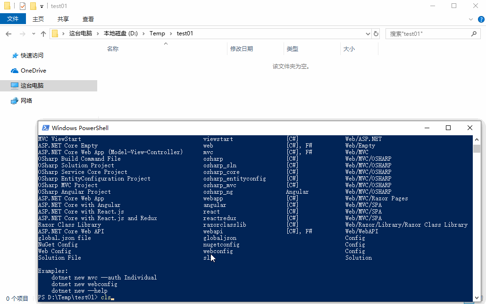
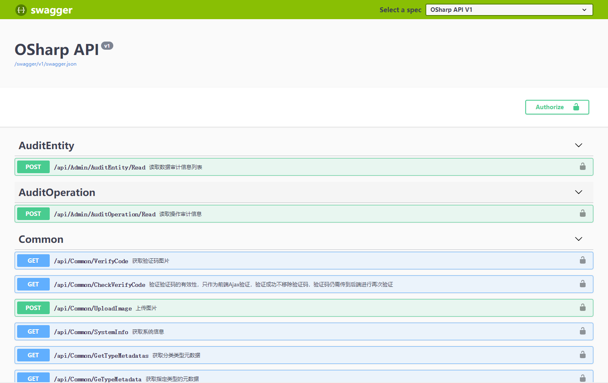
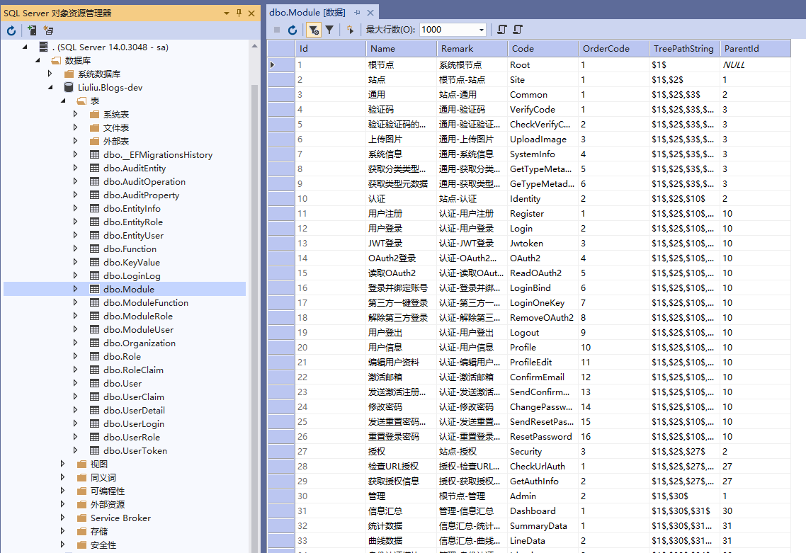
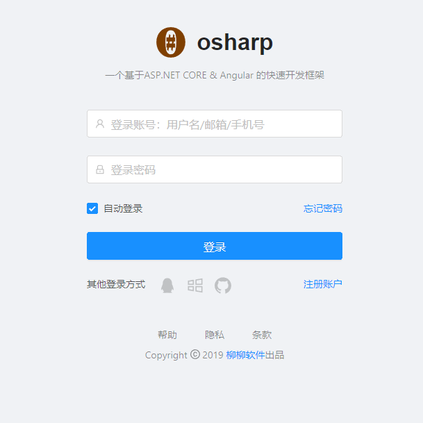
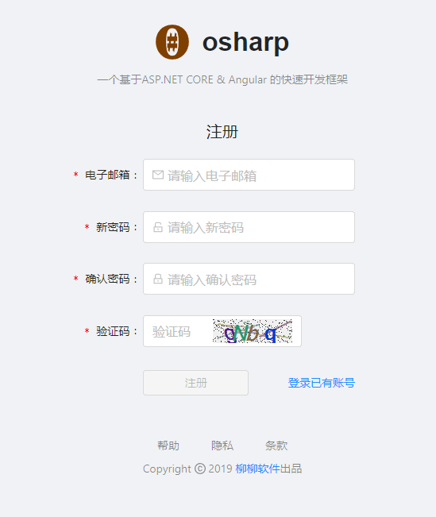
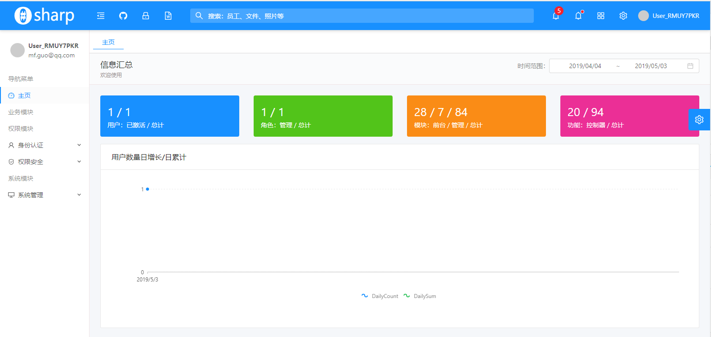
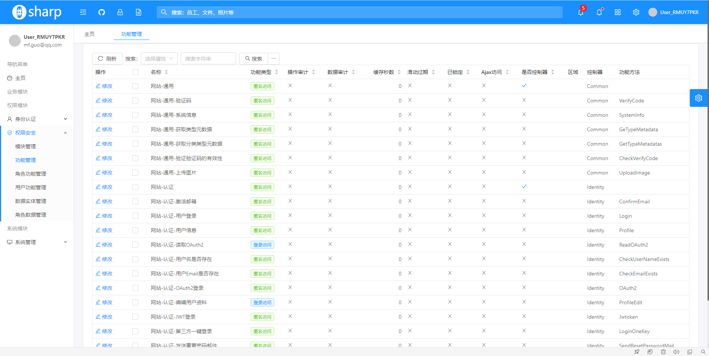
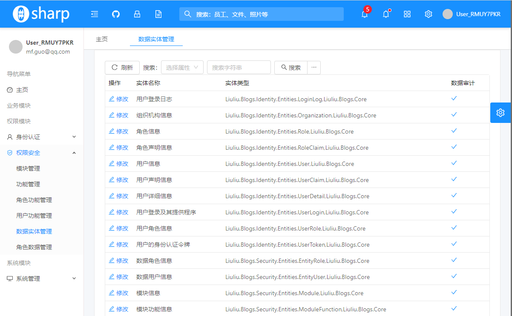

# 快速开始
---
## 开发环境
OSharp 框架使用现在流行的 **前后端分离** 的架构模式，开发环境的初始化涉及后端开发环境和前端开发环境。

### 后端开发环境
后端开发环境指的是 **.NetCore** 的开发环境，涉及到的开发环境为SDK，IDE，数据库等。

#### .NetCore SDK
OSharp 框架的后端是基于 .NetCore 的最新稳定版本的，目前最新稳定版本为 ，请安装最新版本的 SDK。
最新 SDK 下载地址如下：
> [https://dotnet.microsoft.com/download](https://dotnet.microsoft.com/download)

* 点击 **Download .NET Core SDK** 按钮进行最新 SDK 的下载。
* 在服务器部属的时候，不需要完整的 SDK，点击 **Download .NET Core Runtime** 按钮进行最新 Runtime 的下载。

安装完成后，在 `命令提示符` 或 `PowerShell` 窗口输入如下命令，即可查看到本机已安装的 .NetCore 的 SDK 和 Runtime 版本详细信息
> dotnet --info

我的电脑输出如下，可以看到，已经安装了 `6.0.400` 版本的 SDK 和 `6.0.8` 版本的 Runtime：
``` hl_lines="18 21"
.NET SDK (reflecting any global.json):
 Version:   6.0.400
 Commit:    7771abd614

运行时环境:
 OS Name:     Windows
 OS Version:  10.0.19044
 OS Platform: Windows
 RID:         win10-x64
 Base Path:   C:\Program Files\dotnet\sdk\6.0.400\

Host:
  Version:      6.0.8
  Architecture: x64
  Commit:       55fb7ef977

.NET Core SDKs installed:
  6.0.400 [C:\Program Files\dotnet\sdk]

.NET Core runtimes installed:
  Microsoft.AspNetCore.App 6.0.8 [C:\Program Files\dotnet\shared\Microsoft.AspNetCore.App]
  Microsoft.NETCore.App 6.0.8 [C:\Program Files\dotnet\shared\Microsoft.NETCore.App]
  Microsoft.WindowsDesktop.App 6.0.8 [C:\Program Files\dotnet\shared\Microsoft.WindowsDesktop.App]

To install additional .NET Core runtimes or SDKs:
  https://aka.ms/dotnet-download
```

#### IDE (集成开发环境)
* Visual Studio 2022：开发 .NET 程序，当前首先宇宙最强IDE **Visual Studio**，
  > .Net 6.0 推荐将VS2022更新至最新版本。
* Visual Studio Code：如果你觉得VS太过笨重，喜欢比较轻量级的IDE，VS Code 也是个很不错的选择，只需装上 `C#` 插件即可完美运行 .NetCore 代码。VS Code 也是目前最好用的前端IDE，后面将作为前端IDE进行前端代码的开发与运行。

两个IDE都可以在如下的地址中下载：
> https://visualstudio.microsoft.com/zh-hans/downloads/


!!! note "补充"
    当使用 Visual Studio 时，[Resharper](https://www.jetbrains.com/resharper/) 这个插件是个不可错过的插件，可以在 智能提示、变量命名、代码优化、代码重构、代码结构导航、dll反编译查看源代码等方面对 Visual Studio 进行大量不可多得的功能补充。当然，这个插件比较吃资源，需要你有一台性能优良的硬件机器才能流畅使用。
    

#### 数据库
OSharp 框架的数据存储是基于 EntityFrameworkCore (简称EFCore) 这个ORM实现的，只要 EFCore 支持的数据库，都可以作为 OSharp 的数据存储，现已支持数据库如下：

* Microsift SqlServer 2012+
* MySql 5.7+
* Sqlite
* PostgreSql
* Oracle

### 前端开发环境
在前后端分离的项目中，三大前端技术框架 Angular、Vue、React 已经成为不可跨越的必选项，基于历史的原因（osharp的.net fx 版本基于AngularJS），OSharp 的前端是基于 Angular 实现的，考虑到 Vue 在国内不可忽视的市场，Vue 版本的前端也在计划之内，而 React 版本目前还没有排上日程。
要上三大前端，NodeJS 是必须的，可在如下地址获得 NodeJS 的安装包：
> https://nodejs.org/en/

NodeJS 安装 好之后，NPM 也就可以用了。但 NPM 的默认安装源在国外，通常会比较慢，因此需要把 NPM 的安装源设置到国内镜像源，[淘宝镜像](https://npmmirror.com)是个不错的选择，执行如下命令设置将淘宝镜像设置为NPM的安装源：
> npm config set registry https://registry.npmmirror.com/

#### Angular
OSharp 的 [Angular](https://angular.cn)  版前端是基于 [NG-ALAIN](https://ng-alain.com)  前端框架开发的。NG-ALAIN 是一个基于 Antd 中后台前端解决方案，提供更多通用性业务模块，让开发者更加专注于业务。
首先，需要通过 npm 命令全局安装 @angular/cli  运行环境
> npm install -g @angular/cli

#### Vue
OSharp 的 [Vue](https://cn.vuejs.org/index.html)  版前端是基于 [Vben Admin](https://vvbin.cn/doc-next/) ，Vben Admin 是一套基于 [ant-design-vue](https://www.antdv.com/)  的高质量 UI 组件库。
首先，需要通过 npm 命令全局安装 @vue/cli  运行环境
> npm install -g @vue/cli

!!! attention
    由于精力有限及优先级的问题，Vue版本现在尚未开发完成。

## 项目初始化

每一个新项目，都离不开身份认证，权限授权，系统配置，还有相应的前端操作界面等基础而重复的工作，如果每一个新项目都要从０开始做这些重复性工作，是很无味而繁琐的。因此，OSharp 框架制作了一个基于 `dotnet cli` 命令行工具的快速启动模板 [OSharp.Template.WebApi](https://www.nuget.org/packages/OSharp.Template.WebApi/) ，一键搞定这些重复性的模块，让项目启动不再繁琐。下面让我们一起来启动一个新项目。

### 安装 OSharp 的 dotnet new 项目模板
!!! node
    安装项目模板的前提，是已经按照前面的要求下载安装好了 .NetCore SDK。[>>飞机票](#netcore-sdk)

在任意空白文件夹，打开 `cmd` 或 `powershell` 命令行窗口，执行如下命令安装或更新 OSharp .NetCore CLI 项目模板
> dotnet new -i OSharp.Template.WebApi

执行后，将能看到 `osharp_xxx` 系列的命令已安装到 .NetCore CLI 列表中

| Name                               | Command             | Language | Path           |
| ---------------------------------- | ------------------- | -------- | -------------- |
| OSharp Template                    | osharp              | [C#]     | Web/OSHARP     |

其中 `osharp` 是个一键命令，可通过此命令创建一个完整的项目启动解决方案。下面，我们以创建一个 **博客系统** 为例，完整的步骤如下：

1. 执行 osharp 命令，得到一个 `osharp.cmd` 脚本文件

    > dotnet new osharp

    输出：
    ```
    已成功创建模板“OSharp Build Command File”。
    ```

2. 打开 `osharp.cmd` 脚本文件，进行解决方案生成

    > ./osharp.cmd

    输出：
    ```
    －－－－－－－－－－－－－－－－－－－－－－－－－
    - 欢迎使用 OSharp一键模板 命令
    - http://www.osharp.org
    - Copyright @ 2014 - 2019 OSHARP.ORG
    －－－－－－－－－－－－－－－－－－－－－－－－－
    请输入项目名称，推荐形如 “公司.项目”的模式：
    ```

3. 按要求的格式 **公司.项目** 输入项目名称，即生成项目的主命名空间。

    例如，公司的代码为 Liuliu，要创建一个博客系统，则输入 **Liuliu.Blogs** 

    > Liuliu.Blogs

    输出：
    ```
    已成功创建模板“OSharp Solution Project”。
    已成功创建模板“OSharp Service Core Project”。
    已成功创建模板“OSharp EntityConfiguration Project”。
    已成功创建模板“OSharp MVC Project”。
    已成功创建模板“OSharp Angular Project”。
    项目代码生成完成
    ```

至此，一个完整的项目启动解决方案创建完成。
完整的创建过程演示如下：
{.img-fluid tag=1}

## 打开项目，让项目跑起来

### 使用VS2019打开后端 .NetCore 解决方案
使用 VS2019 打开 解决方案文件 `Liuliu.Blogs.sln`，可以看到各个工程之间的引用关系已经配置好了，OSharp框架的各个依赖类库也已引用了 nuget.org 上的相应版本，并将自动完成类库还原。

解决方案项目结构如下：
```
Liuliu.Blogs                                # 解决方案根目录
└─src                                       # 源代码
    ├─Liuliu.Blogs.Core                     # 业务层
    │  ├─Common                             # 通用业务服务
    │  ├─Identity                           # 身份认证模块业务服务
    │  │  ├─Dtos                            # 身份认证模块传输DTO
    │  │  ├─Entities                        # 身份认证模块数据实体
    │  │  └─Events                          # 身份认证模块事件处理器
    │  ├─Security                           # 权限安全模块业务服务
    │  └─Systems                            # 系统模块业务服务
    ├─Liuliu.Blogs.EntityConfiguration      # 实体类数据库映射配置工程
    │  ├─Identity                           # 身份认证模块实体类配置
    │  ├─Security                           # 权限安全模块实体类配置
    │  └─Systems                            # 系统模块实体类配置
    └─Liuliu.Blogs.Web                      # Web工程
       ├─Areas                              # 区域文件夹
       │  └─Admin                           # 管理区域
       │      └─Controllers                 # 管理API控制器
       │          ├─Identity                # 身份认证模块API
       │          ├─Security                # 权限安全模块API
       │          └─Systems                 # 系统模块API
       ├─Controllers                        # 前台API
       ├─Hangfire                           # Hangfire后台工作
       ├─Migrations                         # 数据库迁移
       └─Startups                           # 启动相关代码
```

* Liuliu.Demo.Core： 业务核心工程，顶层文件夹以业务模块内聚，每个文件夹按职责划分文件夹，通常可包含传输对象`Dtos`、实体类型`Entities`、事件处理`Events`等，业务接口IXXXContract与业务实现IXXXService放在外边，如果文件数量多的话也可以建文件夹存放。
* Liuliu.Demo.EntityConfiguration： EFCore实体映射工程，用于配置各个业务实体映射到数据库的映射细节。文件夹也推荐按模块内聚。
* Liuliu.Demo.Web： 网站的Hosting项目，按常规方式使用即可

我们仍需做一点小工作，才能让后端工程跑起来：

1. 将 Web 工程 `Liuliu.Blogs.Web` 设置为启动项目
2. 打开配置文件 `appsettings.Development.json`，启用相应数据库连接配置，并将数据库连接用户名和密码改为本地环境的用户名和密码
```
"SqlServer": {
  "DbContextTypeName": "OSharp.Entity.DefaultDbContext,OSharp.EntityFrameworkCore",
  "ConnectionString": "Server=.;Database=Liuliu.Blogs-dev;User Id={==sa==};
      Password={==Abc123456!==};MultipleActiveResultSets=true",
  "DatabaseType": "SqlServer",
  "LazyLoadingProxiesEnabled": true,
  "AuditEntityEnabled": true,
  "AutoMigrationEnabled": true
}

```

!!! warning "注意"
    数据库配置中，同一上下文（相同的 `DbContextTypeName`）只能配置一种数据库类型（`DatabaseType`），并且要保持在 `appsettings.json` 和 `appsettings.Development.json` 范围内 **全局唯一**，否则将会引发异常无法正常启动。

完成配置后，在 VS2019 上按 `Ctrl+F5` 启动项目，将看到项目正常启动（前提是你已经安装好了相应版本的 .NetCore SDK）。我们将在浏览器看到 `Swagger` 的API页面：
{.img-fluid tag=2}

打开相应的数据库管理软件（本次使用MSSQL，这里使用VS2019自带的 `SQL Server 对象资源管理器`），可以看到数据库已经自动生成，并且必要基础数据已经初始化完成：
{.img-fluid tag=3}


### 使用VSCode打开前端 Angular 项目

使用 VS Code 打开 `src/ui/ng-alain` 文件夹，前端项目是基于 NG-ALAIN，项目结构如下：
```
├── _mock                                       # Mock 数据规则
├── src
│   ├── app
│   │   ├── core                                # 核心模块
│   │   │   ├── i18n
│   │   │   ├── net
│   │   │   │   └── default.interceptor.ts      # 默认HTTP拦截器
│   │   │   ├── services
│   │   │   │   └── startup.service.ts          # 初始化项目配置
│   │   │   └── core.module.ts                  # 核心模块文件
│   │   ├── layout                              # 通用布局
│   │   ├── routes
│   │   │   ├── **                              # 业务目录
│   │   │   ├── routes.module.ts                # 业务路由模块
│   │   │   └── routes-routing.module.ts        # 业务路由注册口
│   │   ├── shared                              # 共享模块
│   │   │   └── shared.module.ts                # 共享模块文件
│   │   ├── app.component.ts                    # 根组件
│   │   └── app.module.ts                       # 根模块
│   │   └── delon.module.ts                     # @delon模块导入
│   ├── assets                                  # 本地静态资源
│   ├── environments                            # 环境变量配置
│   ├── styles                                  # 样式目录
└── └── style.less                              # 样式引导入口
```

按 `Ctrl + ~` 快捷键，调出 VS Code 的命令行控制台，输入 NodeJS 包安装命令：

> npm install

依赖包安装完成之后，输入项目启动命令

> npm start

此命令将会执行如下命令：`ng serve --port 4201 --proxy-config proxy.config.json --open`，其中`--proxy-config proxy.config.json`对前端项目发起的API请求进行了代理，所有以 `/api/`开头的请求，都会转发到服务端项目中进行处理，代理的实际配置如下：

```
{
  "/api": {
    "target": "http://localhost:7001",
    "secure": false
  }
}
```

至此，项目启动完成，将进入登录界面，如下图所示： 
{.img-fluid tag=4}

需要注册一个用户，才能进入系统。

!!! attention 注意
    第一个注册用户将自动拥有 **最高权限** 的 **超级管理员** 角色身份。

注册界面：
{.img-fluid tag=4}

后台主页：
{.img-fluid tag=4}

功能管理：
{.img-fluid tag=4}

数据实体管理：
{.img-fluid tag=4}
