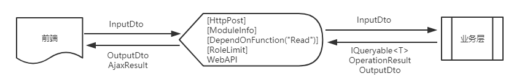
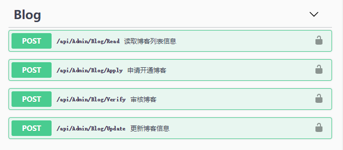
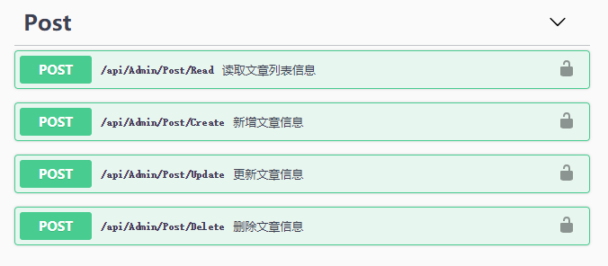
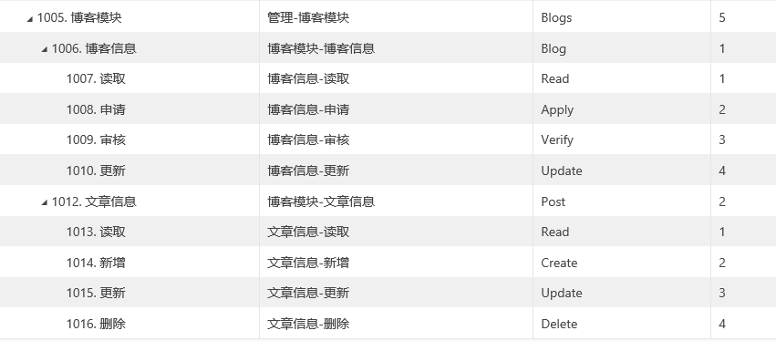
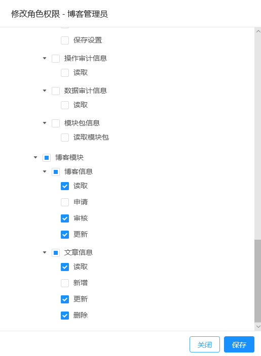
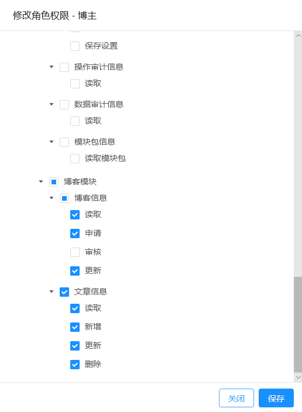
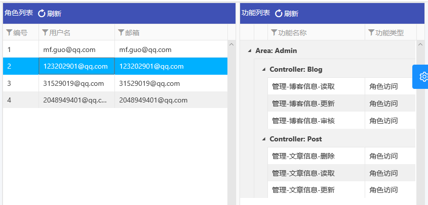
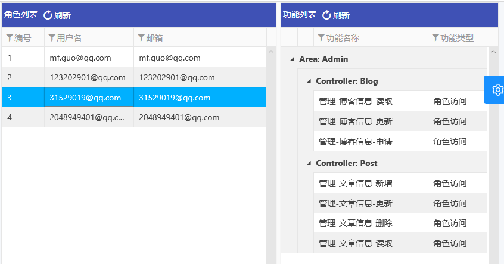
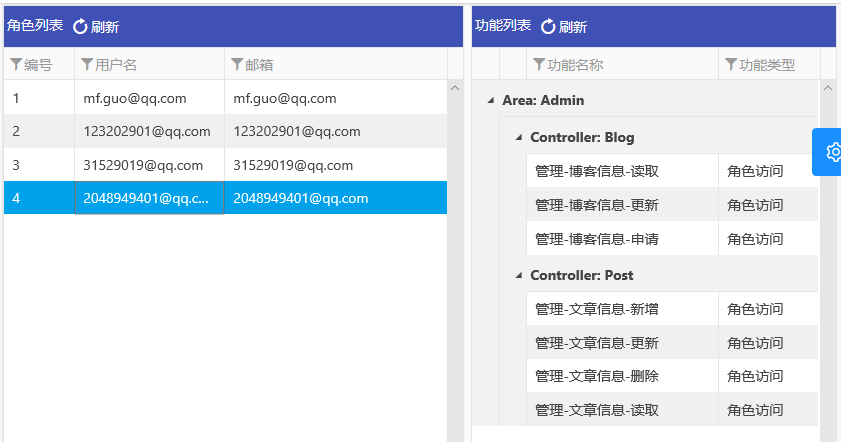
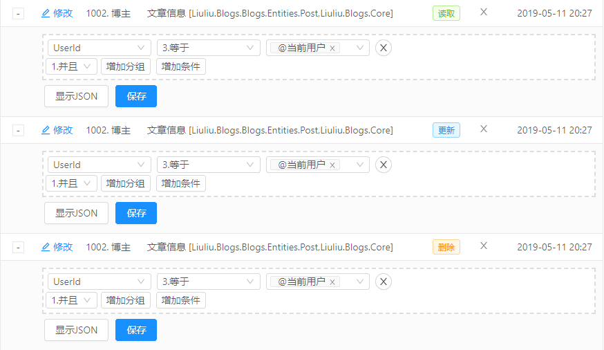

# 添加业务对外API
---
## 概述
一个模块的 API层（Web层），主要负责如下几个方面的工作：

* 接收 `前端层` 提交的数据查询请求，使用 `服务层` 提供的 `IQueryable<T>` 查询数据源，查询出需要的数据返回前端
* 接收 `前端层` 提交的业务处理请求，调用 `服务层` 的服务，处理业务需求，并将操作结果返回前端
* 使用MVC的 `Area-Controller-Action`的层次关系，联合 [`[ModuleInfo]`](https://docs.osharp.org/api/OSharp.Core.Modules.ModuleInfo.html)特性， 定义 Api模块`Module` 的 **树形组织结构**，API模块 的 **依赖关系**，构建出`Module`的树形数据
* 定义 API 的`可访问方式`，API的访问方式可分为 `匿名访问`，`登录访问`和`角色访问`
* 定义自动事务提交，涉及数据库变更的业务，可在API定义自动事务提交，在业务层实现业务时即可不用考虑事务的问题

整个过程如下图所示
{.img-fluid tag=1}

## API层 代码布局

### API层 代码布局分析

API层 即是Web网站服务端的MVC控制器，控制器可按粒度需要不同，分为模块控制器和单实体控制器，这个由业务需求决定。

通常，后台管理的控制器，是实体粒度的，即每个实体都有一个控制器，并且存在于 `/Areas/Admin/Controlers` 文件夹内。

博客模块的 API 层控制器，如下图所示：

```
src                                         # 源代码文件夹
└─Liuliu.Blogs.Web                          # 项目Web工程
    └─Areas                                 # 区域文件夹
       └─Admin                              # 管理区域文件夹
            └─Controllers                   # 管理控制器文件夹
                └─Blogs                     # 博客模块文件夹
                    ├─BlogController.cs     # 博客管理控制器
                    └─PostController.cs     # 文章管理控制器
```

## API定义及访问控制的基础建设

### API定义
API定义即MVC或WebApi的 `Area-Controller-Action` 定义，为方便及规范此步骤的工作，OSharp定义了一些 `API基础控制器基类`，继承这些基类，很容易实现API定义。
#### ApiController
`ApiController` 用于非Area的Api控制器，基类添加了 操作审计`[AuditOperation]`，`[ApiController]`特性，并定义了一个 `[Route("api/[controller]/[action]")]` 的路由特性
```C#
/// <summary>
/// WebApi控制器基类
/// </summary>
[AuditOperation]
[ApiController]
[Route("api/[controller]/[action]")]
public abstract class ApiController : Controller
{
    /// <summary>
    /// 获取或设置 日志对象
    /// </summary>
    protected ILogger Logger => HttpContext.RequestServices.GetLogger(GetType());
}
```
#### AreaApiController
与 无区域控制器基类`ApiController`相对应，对于区域控制器，也定义了一个基类 `AreaApiController`
```C#
/// <summary>
/// WebApi的区域控制器基类
/// </summary>
[AuditOperation]
[ApiController]
[Route("api/[area]/[controller]/[action]")]
public abstract class AreaApiController : Controller
{ }
```

#### AdminApiController
对于相当常用的 管理`Admin` 区域，也同样定义了一个控制器基类`AdminApiController`，此基类继承于`AreaApiController`，并添加了区域特性`[Area("Admin")]`和角色访问限制特性`[RoleLimit]`
```C#
[Area("Admin")]
[RoleLimit]
public abstract class AdminApiController : AreaApiController
{ }
```

#### 博客模块API实现
```
[Description("管理-博客信息")]
public class BlogController : {==AdminApiController==}
{ }

[Description("管理-文章信息")]
public class PostController : {==AdminApiController==}
{ }
```

### Module树形结构及依赖
#### ModuleInfoAttribute
为了描述 API的层级关系，OSharp定义了一个`ModuleInfoAttribute`特性，把当前功能(Controller或者Action)封装为一个模块(Module)节点，可以设置模块依赖的其他功能，模块的位置信息等。此特性用于系统初始化时自动提取模块树信息Module。
```C#
/// <summary>
/// 描述把当前功能(Controller或者Action)封装为一个模块(Module)节点，可以设置模块依赖的其他功能，模块的位置信息等
/// 此特性用于系统初始化时自动提取模块树信息Module
/// </summary>
[AttributeUsage(AttributeTargets.Class | AttributeTargets.Method)]
public class ModuleInfoAttribute : Attribute
{
    /// <summary>
    /// 获取或设置 模块名称，为空则取功能名称
    /// </summary>
    public string Name { get; set; }

    /// <summary>
    /// 获取或设置 模块代码，为空则取功能Action名
    /// </summary>
    public string Code { get; set; }

    /// <summary>
    /// 获取或设置 层次序号
    /// </summary>
    public double Order { get; set; }

    /// <summary>
    /// 获取或设置 模块位置，父级模块，模块在树节点的位置，默认取所在类的位置，需要在命名空间与当前类之间加模块，才设置此值
    /// </summary>
    public string Position { get; set; }

    /// <summary>
    /// 获取或设置 父级位置模块名称，需要在命名空间与当前类之间加模块，才设置此值
    /// </summary>
    public string PositionName { get; set; }
}
```
`[ModuleInfo]`特性主要有两种用法：

* 在`Controller`上，主要控制模块的顺序`Order`，模块的位置`Position`，模块名称`PositionName`，例如：
```C# hl_lines="1"
[ModuleInfo(Position = "Blogs", PositionName = "博客模块")]
[Description("管理-博客信息")]
public class BlogController : AdminApiController
{ }
```
* 在 `Action`上，主要用于标注哪些Action是作为可权限分配的API，通常无需使用属性，例如：
```C# hl_lines="6"
/// <summary>
/// 读取博客
/// </summary>
/// <returns>博客页列表</returns>
[HttpPost]
[ModuleInfo]
[Description("读取")]
public PageData<BlogOutputDto> Read(PageRequest request)
{ }
```
#### DependOnFunctionAttribute
由于业务的关联性和UI的合理布局，API功能点并 **不是单独存在** 的，要完成一个完整的操作，各个API功能点可能会 **存在依赖性**。例如：

* 在要进行管理列表中的 `新增、更新、删除` 等操作，首先要能进入列表，即列表数据的 `读取` 操作，那么 `新增、更新、删除` 等操作就对 `读取` 操作存在依赖需求。
* 对于`新增、更新`操作，通常需要对数据进行`唯一性验证`，那么也会存在依赖关系

为了在代码中描述这些依赖关系，OSharp中定义了`DependOnFunctionAttribute`特性，在Action上标注当前API对其他API（可跨Controller，跨Area）的依赖关系。
```C#
/// <summary>
/// 模块依赖的功能信息，用于提取模块信息Module时确定模块依赖的功能（模块依赖当前功能和此特性设置的其他功能）
/// </summary>
[AttributeUsage(AttributeTargets.Method, AllowMultiple = true, Inherited = false)]
public class DependOnFunctionAttribute : Attribute
{
    /// <summary>
    /// 初始化一个<see cref="DependOnFunctionAttribute"/>类型的新实例
    /// </summary>
    public DependOnFunctionAttribute(string action)
    {
        Action = action;
    }

    /// <summary>
    /// 获取或设置 区域名称，为null（不设置）则使用当前功能所在区域，如要表示无区域的功能，需设置为空字符串""
    /// </summary>
    public string Area { get; set; }

    /// <summary>
    /// 获取或设置 控制器名称，为null（不设置）则使用当前功能所在控制器
    /// </summary>
    public string Controller { get; set; }

    /// <summary>
    /// 获取 功能名称Action，不能为空
    /// </summary>
    public string Action { get; }
}
```
如下示例，表明管理列表中的`新增文章`业务对`文章读取`有依赖关系
```C# hl_lines="8"
/// <summary>
/// 新增文章
/// </summary>
/// <param name="dtos">新增文章信息</param>
/// <returns>JSON操作结果</returns>
[HttpPost]
[ModuleInfo]
[DependOnFunction("Read")]
[UnitOfWork]
[Description("新增")]
public async Task<AjaxResult> Create(PostInputDto[] dtos)
{ }
```

### API访问控制
API的访问控制，分为三种：

* 匿名访问`AllowAnonymousAttribute`：表示当前功能不需要登录即可访问，无视登录状态和角色要求
* 登录访问`LoginedAttribute`：表示当前功能需要登录才能访问，未登录拒绝访问
* 角色访问`RoleLimitAttribute`：表示当前功能需要登录并且用户拥有指定角色，才能访问，未登录或者登录但未拥有指定角色，拒绝访问

API访问控制的控制顺序按照 **就近原则**，即离要执行的功能最近的那个限制生效。以Controller上的标注与Action上的标注为例：

* Controller无，Action无，不限制 
* Controller有，Action无，以Controller为准
* Controller无，Action有，以Action为准
* Controller有，Action有，以Action为准

在`AdminApiController`基类中，已经设置了`[RoleLimit]`，表示Admin区域中的所有Controller和Action的默认访问控制方式就是 角色访问。
```C# hl_lines="2"
[Area("Admin")]
[RoleLimit]
public abstract class AdminApiController : AreaApiController
{ }
```
如想额外控制，则需要在实现Action的时候进行单独配置
```C# hl_lines="3"
[HttpPost]
[ModuleInfo]
[Logined]
[Description("读取")]
public PageData<BlogOutputDto> Read(PageRequest request)
{ }
```

### 自动事务提交
在传统框架中，事务的提交是在业务层实现完业务操作之后即手动提交的，这种方式能更精准的控制事务的结束位置，但也有不能适用的情况，例如当一个业务涉及多个服务的时候，每个服务各自提交了事务，便无法保证所有操作在一个完整的事务上进行了。

为此，OSharp框架提出了一种新的事务提交方式：**在Action中通过Mvc的Filter来自动提交事务**。

自动提交事务是通过如下的`UnitOfWorkAttribute`实现的：
```C# hl_lines="35 48 53 81"
/// <summary>
/// 自动事务提交过滤器，在<see cref="OnResultExecuted"/>方法中执行<see cref="IUnitOfWork.Commit()"/>进行事务提交
/// </summary>
[AttributeUsage(AttributeTargets.Class | AttributeTargets.Method)]
[Dependency(ServiceLifetime.Scoped, AddSelf = true)]
public class UnitOfWorkAttribute : ActionFilterAttribute
{
    private readonly IUnitOfWorkManager _unitOfWorkManager;

    /// <summary>
    /// 初始化一个<see cref="UnitOfWorkAttribute"/>类型的新实例
    /// </summary>
    public UnitOfWorkAttribute(IServiceProvider serviceProvider)
    {
        _unitOfWorkManager = serviceProvider.GetService<IUnitOfWorkManager>();
    }

    /// <summary>
    /// 重写方法，实现事务自动提交功能
    /// </summary>
    /// <param name="context"></param>
    public override void OnResultExecuted(ResultExecutedContext context)
    {
        ScopedDictionary dict = context.HttpContext.RequestServices.GetService<ScopedDictionary>();
        AjaxResultType type = AjaxResultType.Success;
        string message = null;
        if (context.Result is JsonResult result1)
        {
            if (result1.Value is AjaxResult ajax)
            {
                type = ajax.Type;
                message = ajax.Content;
                if (ajax.Successed())
                {
                    _unitOfWorkManager?.Commit();
                }
            }

        }
        else if (context.Result is ObjectResult result2)
        {
            if (result2.Value is AjaxResult ajax)
            {
                type = ajax.Type;
                message = ajax.Content;
                if (ajax.Successed())
                {
                    _unitOfWorkManager?.Commit();
                }
            }
            else
            {
                _unitOfWorkManager?.Commit();
            }
        }
        //普通请求
        else if (context.HttpContext.Response.StatusCode >= 400)
        {
            switch (context.HttpContext.Response.StatusCode)
            {
                case 401:
                    type = AjaxResultType.UnAuth;
                    break;
                case 403:
                    type = AjaxResultType.UnAuth;
                    break;
                case 404:
                    type = AjaxResultType.UnAuth;
                    break;
                case 423:
                    type = AjaxResultType.UnAuth;
                    break;
                default:
                    type = AjaxResultType.Error;
                    break;
            }
        }
        else
        {
            type = AjaxResultType.Success;
            _unitOfWorkManager?.Commit();
        }
        if (dict.AuditOperation != null)
        {
            dict.AuditOperation.ResultType = type;
            dict.AuditOperation.Message = message;
        }
    }
}
```
如一次请求中涉及数据的 新增、更新、删除 操作时，在 Action 上添加 `[UnitOfWork]`，即可实现事务自动提交。
```C# hl_lines="8"
/// <summary>
/// 新增文章
/// </summary>
/// <param name="dtos">新增文章信息</param>
/// <returns>JSON操作结果</returns>
[HttpPost]
[ModuleInfo]
[UnitOfWork]
[Description("新增")]
public async Task<AjaxResult> Create(PostInputDto[] dtos)
{ }
```
### AjaxReuslt
对于 **前后端分离** 的项目，前端向后端的请求都是通过 `application/json` 的方式来交互的，这就需要在后端对操作结果进行封装。OSharp提供了`AjaxResult`类来承载操作结果数据
```C#
/// <summary>
/// 表示Ajax操作结果 
/// </summary>
public class AjaxResult
{
    /// <summary>
    /// 初始化一个<see cref="AjaxResult"/>类型的新实例
    /// </summary>
    public AjaxResult()
        : this(null)
    { }

    /// <summary>
    /// 初始化一个<see cref="AjaxResult"/>类型的新实例
    /// </summary>
    public AjaxResult(string content, AjaxResultType type = AjaxResultType.Success, object data = null)
        : this(content, data, type)
    { }

    /// <summary>
    /// 初始化一个<see cref="AjaxResult"/>类型的新实例
    /// </summary>
    public AjaxResult(string content, object data, AjaxResultType type = AjaxResultType.Success)
    {
        Type = type;
        Content = content;
        Data = data;
    }

    /// <summary>
    /// 获取或设置 Ajax操作结果类型
    /// </summary>
    public AjaxResultType Type { get; set; }

    /// <summary>
    /// 获取或设置 消息内容
    /// </summary>
    public string Content { get; set; }

    /// <summary>
    /// 获取或设置 返回数据
    /// </summary>
    public object Data { get; set; }

    /// <summary>
    /// 是否成功
    /// </summary>
    public bool Successed()
    {
        return Type == AjaxResultType.Success;
    }

    /// <summary>
    /// 是否错误
    /// </summary>
    public bool Error()
    {
        return Type == AjaxResultType.Error;
    }

    /// <summary>
    /// 成功的AjaxResult
    /// </summary>
    public static AjaxResult Success(object data = null)
    {
        return new AjaxResult("操作执行成功", AjaxResultType.Success, data);
    }
}
```
其中`AjaxResultType`的可选项为：
```C#
/// <summary>
/// 表示 ajax 操作结果类型的枚举
/// </summary>
public enum AjaxResultType
{
    /// <summary>
    /// 消息结果类型
    /// </summary>
    Info = 203,

    /// <summary>
    /// 成功结果类型
    /// </summary>
    Success = 200,

    /// <summary>
    /// 异常结果类型
    /// </summary>
    Error = 500,

    /// <summary>
    /// 用户未登录
    /// </summary>
    UnAuth = 401,

    /// <summary>
    /// 已登录，但权限不足
    /// </summary>
    Forbidden = 403,

    /// <summary>
    /// 资源未找到
    /// </summary>
    NoFound = 404,

    /// <summary>
    /// 资源被锁定
    /// </summary>
    Locked = 423
}
```
业务服务层的操作结果`OperationResult`，可以很轻松的转换为`AjaxResult`
```C#
/// <summary>
/// 将业务操作结果转ajax操作结果
/// </summary>
public static AjaxResult ToAjaxResult<T>(this OperationResult<T> result, Func<T, object> dataFunc = null)
{
    string content = result.Message ?? result.ResultType.ToDescription();
    AjaxResultType type = result.ResultType.ToAjaxResultType();
    object data = dataFunc == null ? result.Data : dataFunc(result.Data);
    return new AjaxResult(content, type, data);
}

/// <summary>
/// 将业务操作结果转ajax操作结果
/// </summary>
public static AjaxResult ToAjaxResult(this OperationResult result)
{
    string content = result.Message ?? result.ResultType.ToDescription();
    AjaxResultType type = result.ResultType.ToAjaxResultType();
    return new AjaxResult(content, type);
}

```
通过这些扩展方法，可以很简洁的完成由`OperationResult`到`AjaxResult`的转换
```C#
public async Task<AjaxResult> Creat(PostInputDto[] dtos)
{
    OperationResult result = await _blogsContract.CreatePosts(dtos);
    return result.ToAjaxResult();
}
```

## 博客模块API实现
下面，我们来综合运用上面定义的基础建设，来实现 博客模块 的API层。

API层的实现代码，将实现如下关键点：

* 定义各实体的 Controller 和 Action，使用 `[Description]` 特性来声明各个功能点的显示名称
* 使用`[ModuleInfo]`特性来定义API模块的树形结构
* 使用`[DependOnFunction]`来定义各API模块之间的依赖关系
* 在`AdminApiController`基类中，已经添加了`[RoleLimit]`特性来配置所有`Admin`区域的API都使用 **角色限制** 的访问控制，如需特殊的访问控制，可在 Action 上单独配置
* 涉及实体 `增加、更新、删除` 操作的业务，按需要添加 `[UnitOfWork]` 特性来实现事务自动提交

!!! node
    API模块对角色的权限分配，将在后台管理界面中进行权限分配。

### 博客 - BlogController
根据 <[业务模块设计#WebAPI层](index.md#webapi)> 中对博客管理的定义，Blog实体的对外API定义如下表所示：

| 操作     | 访问类型 | 操作角色               |
| -------- | -------- | ---------------------- |
| 读取     | 角色访问 | 博客管理员、博主       |
| 申请开通 | 登录访问 | 已登录未开通博客的用户 |
| 开通审核 | 角色访问 | 博客管理员             |
| 更新     | 角色访问 | 博客管理员、博主       |

实现代码如下：
```C#
[ModuleInfo(Position = "Blogs", PositionName = "博客模块")]
[Description("管理-博客信息")]
public class BlogController : AdminApiController
{
    /// <summary>
    /// 初始化一个<see cref="BlogController"/>类型的新实例
    /// </summary>
    public BlogController(IBlogsContract blogsContract,
        IFilterService filterService)
    {
        BlogsContract = blogsContract;
        FilterService = filterService;
    }

    /// <summary>
    /// 获取或设置 数据过滤服务对象
    /// </summary>
    protected IFilterService FilterService { get; }

    /// <summary>
    /// 获取或设置 博客模块业务契约对象
    /// </summary>
    protected IBlogsContract BlogsContract { get; }

    /// <summary>
    /// 读取博客列表信息
    /// </summary>
    /// <param name="request">页请求信息</param>
    /// <returns>博客列表分页信息</returns>
    [HttpPost]
    [ModuleInfo]
    [Description("读取")]
    public PageData<BlogOutputDto> Read(PageRequest request)
    {
        Check.NotNull(request, nameof(request));

        Expression<Func<Blog, bool>> predicate = FilterService.GetExpression<Blog>(request.FilterGroup);
        var page = BlogsContract.Blogs.ToPage<Blog, BlogOutputDto>(predicate, request.PageCondition);

        return page.ToPageData();
    }

    /// <summary>
    /// 申请开通博客
    /// </summary>
    /// <param name="dto">博客输入DTO</param>
    /// <returns>JSON操作结果</returns>
    [HttpPost]
    [ModuleInfo]
    [DependOnFunction("Read")]
    [UnitOfWork]
    [Description("申请")]
    public async Task<AjaxResult> Apply(BlogInputDto dto)
    {
        Check.NotNull(dto, nameof(dto));
        OperationResult result = await BlogsContract.ApplyForBlog(dto);
        return result.ToAjaxResult();
    }

    /// <summary>
    /// 审核博客
    /// </summary>
    /// <param name="dto">博客输入DTO</param>
    /// <returns>JSON操作结果</returns>
    [HttpPost]
    [ModuleInfo]
    [DependOnFunction("Read")]
    [UnitOfWork]
    [Description("审核")]
    public async Task<AjaxResult> Verify(BlogVerifyDto dto)
    {
        Check.NotNull(dto, nameof(dto));
        OperationResult result = await BlogsContract.VerifyBlog(dto);
        return result.ToAjaxResult();
    }

    /// <summary>
    /// 更新博客信息
    /// </summary>
    /// <param name="dtos">博客信息输入DTO</param>
    /// <returns>JSON操作结果</returns>
    [HttpPost]
    [ModuleInfo]
    [DependOnFunction("Read")]
    [UnitOfWork]
    [Description("更新")]
    public async Task<AjaxResult> Update(BlogInputDto[] dtos)
    {
        Check.NotNull(dtos, nameof(dtos));
        OperationResult result = await BlogsContract.UpdateBlogs(dtos);
        return result.ToAjaxResult();
    }
}
```

### 文章 - PostController
根据 <[业务模块设计#WebAPI层](index.md#webapi)> 中对文章管理的定义，Post实体的对外API定义如下表所示：

| 操作 | 访问类型 | 操作角色         |
| ---- | -------- | ---------------- |
| 读取 | 角色访问 | 博客管理员、博主 |
| 新增 | 角色访问 | 博主             |
| 更新 | 角色访问 | 博客管理员、博主 |
| 删除 | 角色访问 | 博客管理员、博主 |

实现代码如下：

```C#
[ModuleInfo(Position = "Blogs", PositionName = "博客模块")]
[Description("管理-文章信息")]
public class PostController : AdminApiController
{
    /// <summary>
    /// 初始化一个<see cref="PostController"/>类型的新实例
    /// </summary>
    public PostController(IBlogsContract blogsContract,
        IFilterService filterService)
    {
        BlogsContract = blogsContract;
        FilterService = filterService;
    }

    /// <summary>
    /// 获取或设置 数据过滤服务对象
    /// </summary>
    protected IFilterService FilterService { get; }

    /// <summary>
    /// 获取或设置 博客模块业务契约对象
    /// </summary>
    protected IBlogsContract BlogsContract { get; }

    /// <summary>
    /// 读取文章列表信息
    /// </summary>
    /// <param name="request">页请求信息</param>
    /// <returns>文章列表分页信息</returns>
    [HttpPost]
    [ModuleInfo]
    [Description("读取")]
    public virtual PageData<PostOutputDto> Read(PageRequest request)
    {
        Check.NotNull(request, nameof(request));

        Expression<Func<Post, bool>> predicate = FilterService.GetExpression<Post>(request.FilterGroup);
        var page = BlogsContract.Posts.ToPage<Post, PostOutputDto>(predicate, request.PageCondition);

        return page.ToPageData();
    }

    /// <summary>
    /// 新增文章信息
    /// </summary>
    /// <param name="dtos">文章信息输入DTO</param>
    /// <returns>JSON操作结果</returns>
    [HttpPost]
    [ModuleInfo]
    [DependOnFunction("Read")]
    [UnitOfWork]
    [Description("新增")]
    public virtual async Task<AjaxResult> Create(PostInputDto[] dtos)
    {
        Check.NotNull(dtos, nameof(dtos));
        OperationResult result = await BlogsContract.CreatePosts(dtos);
        return result.ToAjaxResult();
    }

    /// <summary>
    /// 更新文章信息
    /// </summary>
    /// <param name="dtos">文章信息输入DTO</param>
    /// <returns>JSON操作结果</returns>
    [HttpPost]
    [ModuleInfo]
    [DependOnFunction("Read")]
    [UnitOfWork]
    [Description("更新")]
    public virtual async Task<AjaxResult> Update(PostInputDto[] dtos)
    {
        Check.NotNull(dtos, nameof(dtos));
        OperationResult result = await BlogsContract.UpdatePosts(dtos);
        return result.ToAjaxResult();
    }

    /// <summary>
    /// 删除文章信息
    /// </summary>
    /// <param name="ids">文章信息编号</param>
    /// <returns>JSON操作结果</returns>
    [HttpPost]
    [ModuleInfo]
    [DependOnFunction("Read")]
    [UnitOfWork]
    [Description("删除")]
    public virtual async Task<AjaxResult> Delete(int[] ids)
    {
        Check.NotNull(ids, nameof(ids));
        OperationResult result = await BlogsContract.DeletePosts(ids);
        return result.ToAjaxResult();
    }
}
```
至此，博客模块的 API层代码 实现完毕。

### API数据展示

运行`Liuliu.Blogs`项目的后端工程`Liuliu.Blogs.Web`，框架初始化时将通过 **反射读取API层代码结构**，进行博客模块的 **API模块`Module` - API功能点`Function`** 的数据初始化，并分配好 **依赖关系**，功能点的 **访问控制** 等约束。

####Swagger查看数据
在SwaggerUI中，我们可以看到生成的 API模块

* 博客 - Blog
{.img-fluid tag=2}

* 文章 - Post
{.img-fluid tag=2}

#### 后台管理查看数据
运行前端的 Angular 工程，我们可以在后台管理的 **权限安全/模块管理** 中，可看到 `博客模块` 的模块数据以及模块分配的功能点信息
{.img-fluid tag=2}

#### 数据库查看数据

打开数据库管理工具，可以看到 Module 和 Function 两个表的相关数据

* 数据库中的 API模块Module
{.img-fluid tag=2}

* 数据库中的 API功能点Function
{.img-fluid tag=2}

## 博客模块授权

### 相关角色和用户

#### 博客模块相关角色
根据 <[业务模块设计#WebAPI层](index.md#webapi)> 中对权限控制的定义，我们需要创建两个相关角色

* 博主：可申请博客，更新自己的博客，对自己的文章进行新增、更新、删除操作
* 博客管理员：可审批、更新、删除所有博客，对所有文章进行更新、删除操作

新增的两个角色如下：

| 名称       | 备注           | 管理角色 | 默认 | 锁定 |
| ---------- | -------------- | -------- | ---- | ---- |
| 博客管理员 | 博客管理员角色 | 是       | 否   | 否   |
| 博主       | 博客主人角色   | 否       | 否   | 否   |

#### 注册两个测试用户，并给用户分配角色
新增测试用户如下：

| 用户名            | 用户昵称       | 分配角色   |
| ----------------- | -------------- | ---------- |
| 123202901@qq.com  | 博客管理员测试 | 博客管理员 |
| 31529019@qq.com   | 博主测试01     | 博主       |
| 2048949401@qq.com | 博主测试02     | 博主       |

### 功能权限

#### 给角色分配API模块

API模块`Module`对应的是后端的API模块，将Module分配给角色`Role`，相应的Role即拥有Module的所有功能点`Function`
{.img-fluid tag=3}

* 给 `博客管理员` 角色分配功能权限
{.img-fluid tag=3}

* 给 `博主` 角色分配功能权限
{.img-fluid tag=3}

#### 功能权限预览
分配好之后，拥有特定角色的用户，便拥有模块所带来的功能点权限

* 博客管理员用户功能权限
{.img-fluid tag=3}
* 博主用户功能权限
    * 测试博主01
{.img-fluid tag=3}
    * 测试博主02
{.img-fluid tag=3}

### 数据权限

OSharp框架内默认提供 **角色 - 实体** 配对的数据权限指派。

#### 博客管理员
对于`博客管理员`角色，博客管理员能管理 博客`Blog` 和 文章`Post` 的所有数据，没有数据权限的约束要求。

#### 博主
对于`博主`角色，博主只能查看并管理 **自己的** 博客与文章，有数据权限的约束要求。对博主的数据权限约束如下：

* 对博客的读取、更新操作限制 `UserId = @当前用户`
{.img-fluid tag=3}

* 对文章的读取、更新、删除操作限制 `UserId = @当前用户`
{.img-fluid tag=3}

如此，对博客模块的数据权限约束分配完毕。

在下一节中，我们将完善前端项目，添加博客模块的前端实现，你将看到一个完整的博客模块实现。
