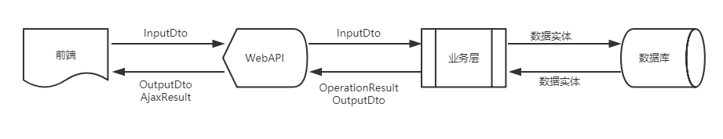
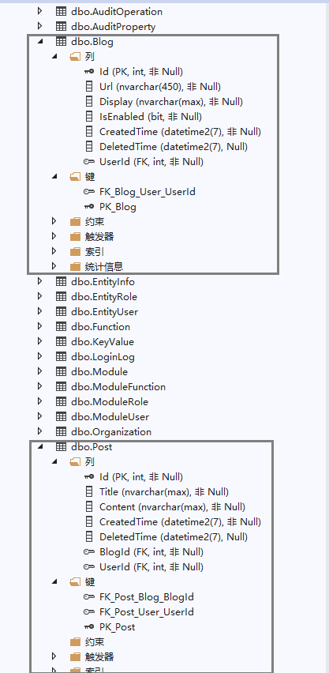

#添加业务数据层
---
## 概述
一个模块的数据层，主要包括如下几个方面：

* 数据实体：数据实体是服务层向数据库进行数据持久化的数据载体，也是数据层进行业务处理的数据载体，数据层与数据层的数据交换都应通过实体类来完成。
* 输入DTO：InputDto用于前端向API层输入数据，API层向服务层输入数据
* 输出DTO：OutputDto主要用于数据查询服务，是API层向前端输出数据的载体
    {.img-fluid tag=1}

* 数据实体映射配置：CodeFirst的开发模式，数据库的设计细节完全靠代码来完成，数据实体映射配置正是负责这项工作的，针对一个实体，可以在这里配置其在数据库中的数据表关系、数据约束及各个数据字段的每一个细节配置。

* 对象Mapper映射：数据传输对象`DTO` 与 实体类`Entity` 之间的转换与更新，如果都要通过手写代码来进行属性的一一对应赋值，是件很累人的事，通过 对象Mapper映射（例如AutoMapper）功能，只需进行一次配置，即可很方便的实现不同类型对象的数据转换与更新。

### 数据层文件夹布局

```
src                                     # 源代码文件夹
├─Liuliu.Blogs.Core                     # 项目核心工程
│  └─Blogs                              # 博客模块文件夹
│      ├─Dtos                           # 博客模块DTO文件夹
│      │    ├─BlogInputDto.cs           # 博客输入DTO
│      │    ├─BlogOutputDto.cs          # 博客输出DTO
│      │    ├─BlogVerifyDto.cs          # 博客审核DTO
│      │    ├─PostInputDto.cs           # 文章输入DTO
│      │    └─PostOutputDto.cs          # 文章输出DTO
│      └─Entities                       # 博客模块实体类文件夹
│           ├─Blog.cs                   # 博客实体类
│           └─Post.cs                   # 文章实体类
└─Liuliu.Blogs.EntityConfiguration      # 实体映射配置工程
   └─Blogs                              # 博客模块文件夹
       ├─BlogConfiguration.cs           # 博客实体映射配置类
       └─PostConfiguration.cs           # 文章实体映射配置类
```

## 实体类

### 必选接口

#### IEntity
数据实体接口：所有的实体类都必须实现 `IEntity` 接口，此接口给实体类添加一个 名为 `Id` 的实体唯一编号属性，这个属性是实体类的 **主键** 属性
``` csharp
/// <summary>
/// 数据模型接口
/// </summary>
/// <typeparam name="TKey">实体主键类型</typeparam>
public interface IEntity<out TKey>
{
    /// <summary>
    /// 获取 实体唯一标识，主键
    /// </summary>
    TKey Id { get; }
}
```

#### EntityBase
实体类基类：为了方便实体类快速实现 `IEntity` 接口，定义了一个通用基类 `EntityBase`，所有实体都可以通过继承此基类方便实现 `IEntity` 接口
```csharp
/// <summary>
/// 实体类基类
/// </summary>
public abstract class EntityBase<TKey> : IEntity<TKey> where TKey : IEquatable<TKey>
{
    /// <summary>
    /// 初始化一个<see cref="EntityBase{TKey}"/>类型的新实例
    /// </summary>
    protected EntityBase()
    {
        if (typeof(TKey) == typeof(Guid))
        {
            Id = CombGuid.NewGuid().CastTo<TKey>();
        }
    }

    /// <summary>
    /// 获取或设置 编号
    /// </summary>
    [DisplayName("编号")]
    public TKey Id { get; set; }

    // ...
}
```

### 可选的装配功能接口与特性
OSharp框架给实体类设计了一些可装配的功能，通过特定的接口来提供，实体类实现了特定的接口，则实体类在系统中将自动拥有一些额外的功能。

#### ICreatedTime
定义创建时间：`ICreatedTime` 接口给实体类添加一个 创建时间`CreatedTime` 的属性，该属性将在数据层执行 创建`Insert` 操作时，自动赋予系统当前时间。
``` C#
/// <summary>
/// 定义创建时间
/// </summary>
public interface ICreatedTime
{
    /// <summary>
    /// 获取或设置 创建时间
    /// </summary>
    DateTime CreatedTime { get; set; }
}
```

#### ILockable
定义可锁定功能：`ILockable` 接口给实体类添加一个 是否锁定`IsLocked` 的属性
```C#
/// <summary>
/// 定义可锁定功能
/// </summary>
public interface ILockable
{
    /// <summary>
    /// 获取或设置 是否锁定当前信息
    /// </summary>
    bool IsLocked { get; set; }
}
```

#### IEntityHash
定义实体Hash功能：给实体添加 `GetHash` 扩展方法，用于对实体的属性值进行Hash，确定实体是否存在变化，这些变化可用于系统初始化时确定是否需要进行数据同步。
当前系统中 实体信息`EntityInfo`, 功能点`Function`, API模块`Module` 在系统启动时与数据库中的相应数据进行对比同步时，使用的就是这个接口的特性
```C#
/// <summary>
/// 定义实体Hash功能，对实体的属性值进行Hash，确定实体是否存在变化，
/// 这些变化可用于系统初始化时确定是否需要进行数据同步
/// </summary>
public interface IEntityHash
{ }
```

#### IExpirable
定义可过期性，包含生效时间和过期时间：给实体添加 生效时间`BeginTime`，过期时间`EndTime` 的属性
``` C#
/// <summary>
/// 定义可过期性，包含生效时间和过期时间
/// </summary>
public interface IExpirable
{
    /// <summary>
    /// 获取或设置 生效时间
    /// </summary>
    DateTime? BeginTime { get; set; }

    /// <summary>
    /// 获取或设置 过期时间
    /// </summary>
    DateTime? EndTime { get; set; }
}
```

#### ICreationAudited
定义创建审计信息：给实体添加创建时的 创建人`CreatorId`，创建时间`CreatedTime` 的审计信息，这些值将在数据层执行 创建`Insert` 时自动赋值。
```C#
/// <summary>
/// 定义创建审计信息
/// </summary>
public interface ICreationAudited<TUserKey> : ICreatedTime
    where TUserKey : struct
{
    /// <summary>
    /// 获取或设置 创建者编号
    /// </summary>
    TUserKey? CreatorId { get; set; }
}
```

!!!node
    `ICreationAudited` 已继承了 `ICreatedTime` 接口，不会重复添加 `CreatedTime` 属性
    
#### IUpdateAudited
定义更新审计的信息：给实体添加更新时的 最后更新人`LastUpdaterId`，最后更新时间`LastUpdatedTime` 的审计信息，这些值将在数据层执行 更新`Update` 操作时自动赋值。
```C#
/// <summary>
/// 定义更新审计的信息
/// </summary>
public interface IUpdateAudited<TUserKey> where TUserKey : struct
{
    /// <summary>
    /// 获取或设置 更新者编号
    /// </summary>
    TUserKey? LastUpdaterId { get; set; }

    /// <summary>
    /// 获取或设置 最后更新时间
    /// </summary>
    DateTime? LastUpdatedTime { get; set; }
}
```

#### ISoftDeletable
定义逻辑删除功能：给实体添加一个用于逻辑删除的 删除时间`DeletedTime` 属性，当实体实现了 `ISoftDeletable` 接口之后，数据层执行 删除 `Delete` 操作时，将 `DeletedTime` 赋予当前时间，即表示数据已被删除。数据查询的时候通过全局过滤器自动过滤掉 `DeletedTime` 不为 null 的数据，从而查询出正常数据。
```C#
/// <summary>
/// 定义逻辑删除功能
/// </summary>
public interface ISoftDeletable
{
    /// <summary>
    /// 获取或设置 数据逻辑删除时间，为null表示正常数据，有值表示已逻辑删除，同时删除时间每次不同也能保证索引唯一性
    /// </summary>
    DateTime? DeletedTime { get; set; }
}
```

#### UserFlagAttribute
用户标记特性：此特性与数据权限有关，用于实体类的 用户编号`UserId` 属性，用于标记实体类中与用户私有数据相关联的用户编号，以在数据权限判断时，将实体的用户编号与当前在线用户的用户编号进行对比，找出用户的私有数据。
```C#
    /// <summary>
    /// 用户标记，用于标示用户属性/字段
    /// </summary>
    [AttributeUsage(AttributeTargets.Property)]
    public class UserFlagAttribute : Attribute
    { }
```

### 博客模块的实体类定义

回到我们的 `Liuliu.Blogs` 项目，根据 <[业务模块设计#模块文件夹结构布局](index.md#_3)> 给出的结构，在 `Liuliu.Blogs.Core` 项目中创建 `Blogs/Entities` 的文件夹存放实体类，添加如下实体类文件。

#### 博客实体 - Blog
```C#
namespace Liuliu.Blogs.Blogs.Entities
{
    /// <summary>
    /// 实体类：博客信息
    /// </summary>
    [Description("博客信息")]
    public class Blog : EntityBase<int>, ICreatedTime
    {
        /// <summary>
        /// 获取或设置 博客地址
        /// </summary>
        [Required]
        public string Url { get; set; }

        /// <summary>
        /// 获取或设置 显示名称
        /// </summary>
        [Required]
        public string Display { get; set; }

        /// <summary>
        /// 获取或设置 已开通
        /// </summary>
        public bool IsEnabled { get; set; }

        /// <summary>
        /// 获取或设置 创建时间
        /// </summary>
        public DateTime CreatedTime { get; set; }

        /// <summary>
        /// 获取或设置 作者编号
        /// </summary>
        [UserFlag]
        public int UserId { get; set; }

        /// <summary>
        /// 获取或设置 作者
        /// </summary>
        public virtual User User { get; set; }
    }
}
```
#### 文章实体 - Post
```C#
namespace Liuliu.Blogs.Blogs.Entities
{
    /// <summary>
    /// 实体类：文章信息
    /// </summary>
    [Description("文章信息")]
    public class Post:EntityBase<int>, ICreatedTime, ISoftDeletable
    {
        /// <summary>
        /// 获取或设置 文章标题
        /// </summary>
        [Required]
        public string Title { get; set; }

        /// <summary>
        /// 获取或设置 文章内容
        /// </summary>
        [Required]
        public string Content { get; set; }

        /// <summary>
        /// 获取或设置 创建时间
        /// </summary>
        public DateTime CreatedTime { get; set; }

        /// <summary>
        /// 获取或设置 数据逻辑删除时间，为null表示正常数据，有值表示已逻辑删除
        /// </summary>
        public DateTime? DeletedTime { get; set; }

        /// <summary>
        /// 获取或设置 所属博客编号
        /// </summary>
        public int BlogId { get; set; }

        /// <summary>
        /// 获取或设置 所属博客
        /// </summary>
        public virtual Blog Blog { get; set; }

        /// <summary>
        /// 获取或设置 作者编号
        /// </summary>
        [UserFlag]
        public int UserId { get; set; }

        /// <summary>
        /// 获取或设置 作者
        /// </summary>
        public virtual User User { get; set; }
    }
}
```

## 输入输出DTO
输入输出DTO：输入输出DTO主要负责各层次之间的数据传输工作，避免在外层暴露实体类。

### 输入输出DTO相关接口

#### InputDto
定义输入DTO：输入DTO 需实现此接口，作为 业务层参数类型、DTO属性合法性验证数据类型 的约束。
```C#
/// <summary>
/// 定义输入DTO
/// </summary>
/// <typeparam name="TKey"></typeparam>
public interface IInputDto<TKey>
{
    /// <summary>
    /// 获取或设置 主键，唯一标识
    /// </summary>
    TKey Id { get; set; }
}
```

#### IOutputDto
定义输出DTO：输出DTO 需实现此接口，此接口将作为 分页查询 返回类型的约束。
```C#
    /// <summary>
    /// 定义输出DTO
    /// </summary>
    public interface IOutputDto
    { }
```

#### 数据实体映射
定义数据权限的更新，删除状态：用于 输入DTO`IOutputDto`，此接口为输出DTO提供 是否允许更新`Updatable`、是否允许删除`Deletable` 两个数据权限属性，输出DTO实现了此接口，在进行数据分页查询时，将使用 **全实体** 查询模式并进行 **数据权限校验**，在输出DTO中自动附加数据权限（是否可更新、是否可删除）信息。
```C#
    /// <summary>
    /// 定义数据权限的更新，删除状态
    /// </summary>
    public interface IDataAuthEnabled
    {
        /// <summary>
        /// 获取或设置 是否可更新的数据权限状态
        /// </summary>
        bool Updatable { get; set; }

        /// <summary>
        /// 获取或设置 是否可删除的数据权限状态
        /// </summary>
        bool Deletable { get; set; }
    }
```

### 博客模块的输入输出DTO类定义

回到我们的 `Liuliu.Blogs` 项目，根据 <[业务模块设计#模块文件夹结构布局](index.md#_3)> 给出的结构，在 `Liuliu.Blogs.Core` 项目中创建 `Blogs/Dtos` 的文件夹存放实体类，添加如下输入输出DTO类文件。

#### 博客 - Blog

博客 InputDto
```C#
/// <summary>
/// 输入DTO：博客信息
/// </summary>
public class BlogInputDto : IInputDto<int>
{
    /// <summary>
    /// 获取或设置 博客编号
    /// </summary>
    public int Id { get; set; }

    /// <summary>
    /// 获取或设置 博客地址
    /// </summary>
    [Required]
    public string Url { get; set; }

    /// <summary>
    /// 获取或设置 显示名称
    /// </summary>
    [Required]
    public string Display { get; set; }
}

```

博客 OutputDto
```C#
/// <summary>
/// 输出DTO：博客信息
/// </summary>
public class BlogOutputDto : IOutputDto, IDataAuthEnabled
{
    /// <summary>
    /// 获取或设置 博客编号
    /// </summary>
    public int Id { get; set; }

    /// <summary>
    /// 获取或设置 博客地址
    /// </summary>
    public string Url { get; set; }

    /// <summary>
    /// 获取或设置 显示名称
    /// </summary>
    public string Display { get; set; }

    /// <summary>
    /// 获取或设置 已开通
    /// </summary>
    public bool IsEnabled { get; set; }

    /// <summary>
    /// 获取或设置 创建时间
    /// </summary>
    public DateTime CreatedTime { get; set; }

    /// <summary>
    /// 获取或设置 作者编号
    /// </summary>
    public int UserId { get; set; }

    /// <summary>
    /// 获取或设置 是否可更新的数据权限状态
    /// </summary>
    public bool Updatable { get; set; }

    /// <summary>
    /// 获取或设置 是否可删除的数据权限状态
    /// </summary>
    public bool Deletable { get; set; }
}
```

博客 VerifyDto
```C#
/// <summary>
/// 输入DTO：审核博客信息
/// </summary>
public class BlogVerifyDto : IInputDto<int>
{
    /// <summary>
    /// 获取或设置 博客编号
    /// </summary>
    public int Id { get; set; }

    /// <summary>
    /// 获取或设置 是否开通
    /// </summary>
    public bool IsEnabled { get; set; }

    /// <summary>
    /// 获取或设置 审核理由
    /// </summary>
    [Required]
    public string Reason { get; set; }
}
```

#### 文章 - Post

文章 InputDto
```C#
/// <summary>
/// 输入DTO：文章信息
/// </summary>
public class PostInputDto : IInputDto<int>
{
    /// <summary>
    /// 获取或设置 文章编号
    /// </summary>
    public int Id { get; set; }

    /// <summary>
    /// 获取或设置 文章标题
    /// </summary>
    [Required]
    public string Title { get; set; }

    /// <summary>
    /// 获取或设置 文章内容
    /// </summary>
    [Required]
    public string Content { get; set; }
}
```

文章 OutputDto
```C#
/// <summary>
/// 输出DTO：文章信息
/// </summary>
public class PostOutputDto : IOutputDto, IDataAuthEnabled
{
    /// <summary>
    /// 获取或设置 文章编号
    /// </summary>
    public int Id { get; set; }

    /// <summary>
    /// 获取或设置 文章标题
    /// </summary>
    public string Title { get; set; }

    /// <summary>
    /// 获取或设置 文章内容
    /// </summary>
    public string Content { get; set; }

    /// <summary>
    /// 获取或设置 创建时间
    /// </summary>
    public DateTime CreatedTime { get; set; }

    /// <summary>
    /// 获取或设置 所属博客编号
    /// </summary>
    public int BlogId { get; set; }

    /// <summary>
    /// 获取或设置 作者编号
    /// </summary>
    [UserFlag]
    public int UserId { get; set; }

    /// <summary>
    /// 获取或设置 是否可更新的数据权限状态
    /// </summary>
    public bool Updatable { get; set; }

    /// <summary>
    /// 获取或设置 是否可删除的数据权限状态
    /// </summary>
    public bool Deletable { get; set; }
}
```

## 数据实体映射配置

OSharp框架中，实体映射配置类主要有两个作用：

1. 在系统初始化时将实体类加载到上下文中
2. 实现实体类到数据库的映射细节配置

### 相关接口与基类

#### IEntityRegister
将实体配置类注册到上下文中：`IEntityRegister` 接口定义了一个`DbContextType`属性，可将一个实体类注册到指定的上下文中，这在自定义多个数据上下文的时候会用到。
在实体映射类中实现此接口，数据上下文初始化的时候，在`OnModelCreating`方法中通过调用`RegisterTo(ModelBuilder modelBuilder)`方法，将实体映射类的实例注册到`ModelBuilder`中。
```C#
/// <summary>
/// 定义将实体配置类注册到上下文中
/// </summary>
public interface IEntityRegister
{
    /// <summary>
    /// 获取所属的上下文类型，如为null，将使用默认上下文，否则使用指定类型的上下文类型
    /// </summary>
    Type DbContextType { get; }

    /// <summary>
    /// 获取 相应的实体类型
    /// </summary>
    Type EntityType { get; }

    /// <summary>
    /// 将当前实体类映射对象注册到数据上下文模型构建器中
    /// </summary>
    /// <param name="modelBuilder">上下文模型构建器</param>
    void RegisterTo(ModelBuilder modelBuilder);
}
```

#### EntityTypeConfigurationBase
数据实体映射配置基类：为方便实现实体映射配置类，OSharp定义了此基类，实现了 `IEntityTypeConfiguration<TEntity>`，`IEntityRegister` 两个接口，在实现实体映射配置类时，只需继承此类，实现`Configure(EntityTypeBuilder<TEntity> builder)`抽象方法即可。
```C# hl_lines="38"
/// <summary>
/// 数据实体映射配置基类
/// </summary>
/// <typeparam name="TEntity">实体类型</typeparam>
/// <typeparam name="TKey">主键类型</typeparam>
public abstract class EntityTypeConfigurationBase<TEntity, TKey> : IEntityTypeConfiguration<TEntity>, IEntityRegister
    where TEntity : class, IEntity<TKey>
    where TKey : IEquatable<TKey>
{
    /// <summary>
    /// 获取 所属的上下文类型，如为null，将使用默认上下文， 否则使用指定类型的上下文类型
    /// </summary>
    public virtual Type DbContextType => null;

    /// <summary>
    /// 获取 相应的实体类型
    /// </summary>
    public Type EntityType => typeof(TEntity);

    /// <summary>
    /// 将当前实体类映射对象注册到数据上下文模型构建器中
    /// </summary>
    /// <param name="modelBuilder">上下文模型构建器</param>
    public void RegisterTo(ModelBuilder modelBuilder)
    {
        modelBuilder.ApplyConfiguration(this);
        // 给软删除的实体添加全局过滤器
        if (typeof(ISoftDeletable).IsAssignableFrom(typeof(TEntity)))
        {
            modelBuilder.Entity<TEntity>().HasQueryFilter(m => ((ISoftDeletable)m).DeletedTime == null);
        }
    }

    /// <summary>
    /// 重写以实现实体类型各个属性的数据库配置
    /// </summary>
    /// <param name="builder">实体类型创建器</param>
    public abstract void Configure(EntityTypeBuilder<TEntity> builder);
}
```

### 博客模块的实体映射配置类实现

回到我们的 `Liuliu.Blogs` 项目，根据 <[业务模块设计#模块文件夹结构布局](index.md#_3)> 给出的结构，在 `Liuliu.Blogs.EntityConfiguration` 项目中创建 `Blogs` 的文件夹存放实体类，添加如下实体映射配置类文件。


#### 博客 - Blog
根据 <[业务模块设计#数据层](index.md#_5)> 的定义，博客实体的设计要求`Url`属性 **唯一索引**，并且 **博客与博主** 之间的关系是 **一对一**，因此做如下约束：

1. 创建`Url`属性的唯一索引，形式本应是`builder.HasIndex(m => m.Url)`，但博客实体引入了逻辑删除，因此唯一索引应加入逻辑删除属性`DeletedTime`
2. 博客实体与用户实体之间以`UserId`为外键，建立一对一关系，并且对于一个博客来说，其拥有者是必须的，因此需要加上`IsRequired`约束，并禁止级联删除。

```C#
/// <summary>
/// 实体映射配置类：博客信息
/// </summary>
public class BlogConfiguration : EntityTypeConfigurationBase<Blog, int>
{
    /// <summary>
    /// 重写以实现实体类型各个属性的数据库配置
    /// </summary>
    /// <param name="builder">实体类型创建器</param>
    public override void Configure(EntityTypeBuilder<Blog> builder)
    {
        builder.HasIndex(m => m.Url).HasName("BlogUrlIndex").IsUnique();
        builder.HasOne(m => m.User).WithOne().HasForeignKey<Blog>(m => m.UserId).OnDelete(DeleteBehavior.Restrict).IsRequired();
    }
}
```

#### 文章 - Post
根据 <[业务模块设计#数据层](index.md#_5)> 的定义，文章实体的设计要求 **文章与博客** 之间的关系是 **多对一**，**文章与作者** 之间的关系是 **多对一**，因此做如下约束：

1. 文章实体与博客实体之间以`BlogId`为外键，建立多对一关系，并且对于一篇文章来说，其所在博客是必须的，因此需要加上`IsRequired`约束，并禁止级联删除。
2. 文章实体与用户实体之间以`UserId`为外键，建立多对一关系，并且对于一篇文章来说，其作者是必须的，因此需要加上`IsRequired`约束，并禁止级联删除。

```C#
    /// <summary>
    /// 实体映射配置类：文章信息
    /// </summary>
    public class PostConfiguration : EntityTypeConfigurationBase<Post, int>
    {
        /// <summary>
        /// 重写以实现实体类型各个属性的数据库配置
        /// </summary>
        /// <param name="builder">实体类型创建器</param>
        public override void Configure(EntityTypeBuilder<Post> builder)
        {
            builder.HasOne(m => m.Blog).WithMany().HasForeignKey(m => m.BlogId).OnDelete(DeleteBehavior.Restrict).IsRequired();
            builder.HasOne(m => m.User).WithMany().HasForeignKey(m => m.UserId).OnDelete(DeleteBehavior.Restrict).IsRequired();
        }
    }
```

## 对象Mapper映射
对象Mapper映射，指的是同一实体数据的不同类型的相同属性（亦可是不同属性之间，需要单独配置）之间的数据赋值与更新操作。例如：

* 新增业务中使用 InputDto 创建 新的实体类
* 更新业务中通过 InputDto 更新 已存在的实体类
* 数据查询中将 实体类 转换为指定的 OutputDto
* 其他不同类型的数据之间的数据赋值与更新

### 对象Mapper映射相关基础建设

OSharp框架中定义了一些基础建设代码，用于定义对象映射功能。
#### IMapper
`IMapper` 接口用于定义对象映射功能，业务代码中依赖此接口实现对象映射工作，系统初始化时，将使用具体的对象映射框架（如 `AutoMapper`，``）
```C#
/// <summary>
/// 定义对象映射功能
/// </summary>
public interface IMapper
{
    /// <summary>
    /// 将对象映射为指定类型
    /// </summary>
    /// <typeparam name="TTarget">要映射的目标类型</typeparam>
    /// <param name="source">源对象</param>
    /// <returns>目标类型的对象</returns>
    TTarget MapTo<TTarget>(object source);

    /// <summary>
    /// 使用源类型的对象更新目标类型的对象
    /// </summary>
    /// <typeparam name="TSource">源类型</typeparam>
    /// <typeparam name="TTarget">目标类型</typeparam>
    /// <param name="source">源对象</param>
    /// <param name="target">待更新的目标对象</param>
    /// <returns>更新后的目标类型对象</returns>
    TTarget MapTo<TSource, TTarget>(TSource source, TTarget target);

    /// <summary>
    /// 将数据源映射为指定输出DTO的集合
    /// </summary>
    /// <typeparam name="TOutputDto">输出DTO类型</typeparam>
    /// <param name="source">数据源</param>
    /// <param name="membersToExpand">成员展开</param>
    /// <returns>输出DTO的结果集</returns>
    IQueryable<TOutputDto> ToOutput<TOutputDto>(IQueryable source, params Expression<Func<TOutputDto, object>>[] membersToExpand);
}
```

#### MapFromAttribute，MapToAttribute

`MapFrom`和`MapTo`两个特性用于类型的 **同类型同名属性** 的简单映射，不能支持复杂属性间的映射关系。

* [MapFrom]：标注从`源类型`到`当前类型`的Mapping映射关系，例如在 OutputDto 上标注`[MapFrom(typeof(Entity))]`，即表示OutputDto是从Entity映射而来的
```C#
/// <summary>
/// 标注当前类型从源类型的Mapping映射关系
/// </summary>
public class MapFromAttribute : Attribute
{
    /// <summary>
    /// 初始化一个<see cref="MapFromAttribute"/>类型的新实例
    /// </summary>
    public MapFromAttribute(params Type[] sourceTypes)
    {
        Check.NotNull(sourceTypes, nameof(sourceTypes));
        SourceTypes = sourceTypes;
    }

    /// <summary>
    /// 源类型
    /// </summary>
    public Type[] SourceTypes { get; }
}
```
* [MapTo]：标注从`当前类型`到`目标类型`的Mapping映射关系，例如在 Input 上标注`[MapTo(typeof(Entity))]`，即表示可从InputDto通过映射创建或更新Entity
```C#
/// <summary>
/// 标注当前类型映射到目标类型的Mapping映射关系
/// </summary>
public class MapToAttribute : Attribute
{
    /// <summary>
    /// 初始化一个<see cref="MapToAttribute"/>类型的新实例
    /// </summary>
    public MapToAttribute(params Type[] targetTypes)
    {
        Check.NotNull(targetTypes, nameof(targetTypes));
        TargetTypes = targetTypes;
    }

    /// <summary>
    /// 目标类型
    /// </summary>
    public Type[] TargetTypes { get; }
}
```

#### IAutoMapperConfiguration
在使用`AutoMapper`的场景下，要实现复杂属性的映射配置，需要实现此接口并通过`MapperConfigurationExpression`配置复杂类型间的属性映射关系
```C#
/// <summary>
/// 定义通过<see cref="MapperConfigurationExpression"/>配置对象映射的功能
/// </summary>
[MultipleDependency]
public interface IAutoMapperConfiguration
{
    /// <summary>
    /// 创建对象映射
    /// </summary>
    /// <param name="mapper">映射配置表达</param>
    void CreateMaps(MapperConfigurationExpression mapper);
}
```

### 博客模块的映射关系配置
回到我们的 `Liuliu.Blogs` 项目，博客实体和文章实体与他们的DTO之间的映射关系，均可以通过`[MapFrom]，[MapTo]`特性来进行配置，用法很简单，只需在前面定义的DTO类型上加上相应的特性即可：

#### 博客 - Blog
博客 InputDto
```C#
/// <summary>
/// 输入DTO：博客信息
/// </summary>
[MapTo(typeof(Blog))]
public class BlogInputDto : IInputDto<int>
{
    //...
}
```
博客 OutputDto

```C#
/// <summary>
/// 输出DTO：博客信息
/// </summary>
[MapFrom(typeof(Blog))]
public class BlogOutputDto : IOutputDto, IDataAuthEnabled
{
    //...
}
```
#### 文章 - Post
文章 InputDto
```C#
/// <summary>
/// 输入DTO：文章信息
/// </summary>
[MapTo(typeof(Post))]
public class PostInputDto : IInputDto<int>
{
    //...
}
```
文章 OutputDto

```C#
/// <summary>
/// 输出DTO：文章信息
/// </summary>
[MapFrom(typeof(Post))]
public class PostOutputDto : IOutputDto, IDataAuthEnabled
{
    //...
}
```

至此，博客模块的数据层代码实现完毕。下面可进行数据迁移将数据结构更新到现有数据库中。

## 数据迁移
打开 VS2019 的 **程序包管理器控制台**，将默认项目设置为 `src\Liuliu.Blogs.Web`，执行如下命令添加名称为`AddBlogsEntities`的新的迁移记录：

> add-migration AddBlogsEntities

再执行数据库更新命令，执行迁移
> update-database

数据迁移完毕，整个过程输出如下：
``` hl_lines="1 4"
PM> add-migration AddBlogsEntities
entryAssemblyName: Liuliu.Blogs.Web
To undo this action, use Remove-Migration.
PM> update-database
entryAssemblyName: Liuliu.Blogs.Web
Applying migration '20190504130412_AddBlogsEntities'.
Done.
PM> 
```

打开数据库，我们将看到新的数据表`dbo.Blog`和`dbo.Post`已经成功创建：
{.img-fluid tag=2}
