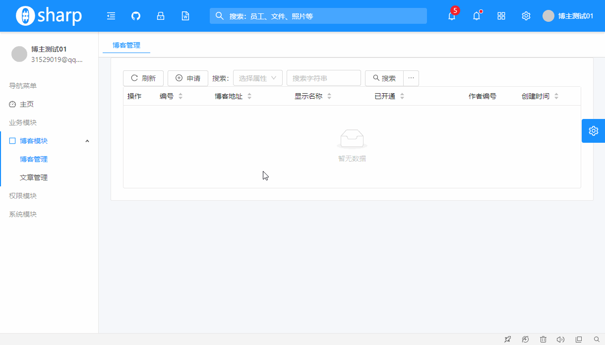
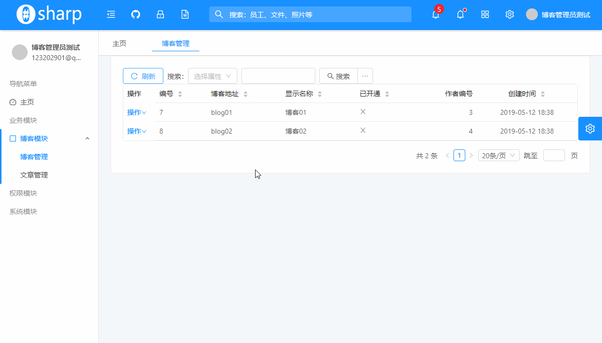
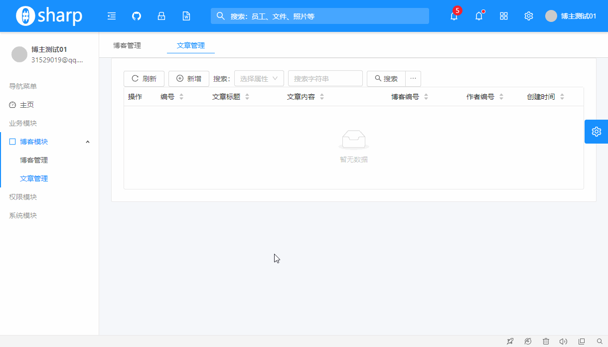
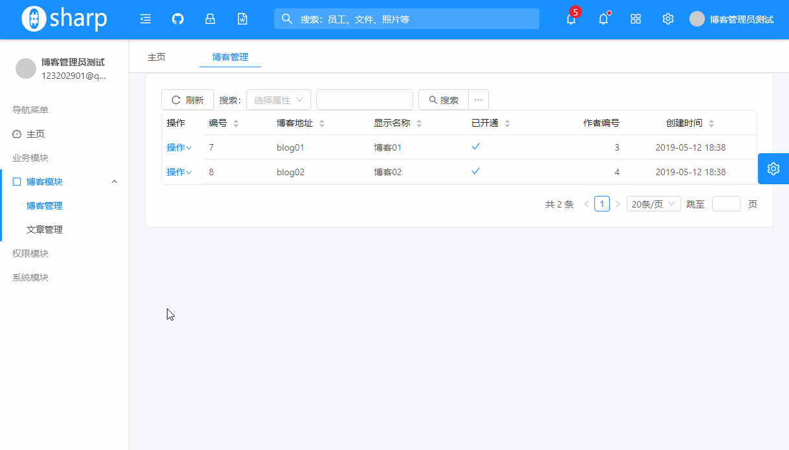

# 添加前端Angular模块
---
## 概述
前后端分离的系统中，前端和后端只有必要的数据通信交互，前端相当于一个完整的客户端应用程序，需要包含如下几个方面：

* 各个模块的布局组合
* 各个页面的路由连接
* 业务功能的数据展现和操作流程体现
* 操作界面的菜单/按钮权限控制

OSharp的Angular前端是基于 **NG-ALAIN** 框架的，这个框架基于阿里的 **NG-ZORRO** 封装了很多方便实用的组件，让我们很方便的实现自己需要的前端界面布局。

### 前端业务模块代码布局

在Angular应用程序中，存在着模块`module`的组织形式，一个后端的模块正好可以对应着前端的一个`module`。

博客模块涉及的代码文件布局如下：

```
src                                         # 源代码文件夹
└─app                                       # APP文件夹
   └─routes                                 # 路由文件夹
       └─blogs                              # 博客模块文件夹
           ├─blogs.module.ts                # 博客模块文件
           ├─blogs.routing.ts               # 博客模块路由文件
           ├─blog                           # 博客组件文件夹
           │   ├─blog.component.html        # 博客组件模板文件
           │   └─blog.component.ts          # 博客组件文件
           └─post                           # 文章组件文件夹
               ├─post.component.html        # 文章组件模板文件
               └─post.component.ts          # 文章组件文件
```

## 业务组件
组件`Component`是Angular应用程序的最小组织单元，是完成数据展现和业务操作的基本场所。

一个组件通常包含 `组件类` 和 `组件模板` 两个部分，如需要，还可包含 `组件样式`。

### STComponentBase

为方便实现各个数据实体的通用管理列表，OSharp定义了一个通用列表组件基类 `STComponentBase`，基于这个基类，只需要传入几个关键的配置信息，即可很方便的实现一个后台管理的实体列表信息。`STComponentBase`主要特点如下：

* 使用了 NG-ALAIN 的 **STComponent** 实现数据表格
* 使用 **SFComponent + NzModalComponent** 实现数据的 `添加/编辑` 操作
* 封装了一个通用的高级查询组件`AdSearchComponent`，可以很方便实现数据的多条件/条件组无级嵌套数据查询功能
* 对列表组件进行统一的界面布局，使各列表风格一致
* 提供了对列表数据的 `读取/添加/编辑/删除` 的默认实现
* 极易扩展其他表格功能

STComponentBase 代码实现如下：
```ts
export abstract class STComponentBase {
  moduleName: string;

  // URL
  readUrl: string;
  createUrl: string;
  updateUrl: string;
  deleteUrl: string;

  // 表格属性
  columns: STColumn[];
  request: PageRequest;
  req: STReq;
  res: STRes;
  page: STPage;
  @ViewChild('st') st: STComponent;

  // 编辑属性

  schema: SFSchema;
  ui: SFUISchema;
  editRow: STData;
  editTitle = '编辑';
  @ViewChild('modal') editModal: NzModalComponent;

  osharp: OsharpService;
  alain: AlainService;
  selecteds: STData[] = [];

  public get http(): _HttpClient {
    return this.osharp.http;
  }

  constructor(injector: Injector) {
    this.osharp = injector.get(OsharpService);
    this.alain = injector.get(AlainService);
  }

  protected InitBase() {
    this.readUrl = `api/admin/${this.moduleName}/read`;
    this.createUrl = `api/admin/${this.moduleName}/create`;
    this.updateUrl = `api/admin/${this.moduleName}/update`;
    this.deleteUrl = `api/admin/${this.moduleName}/delete`;

    this.request = new PageRequest();
    this.columns = this.GetSTColumns();
    this.req = this.GetSTReq(this.request);
    this.res = this.GetSTRes();
    this.page = this.GetSTPage();

    this.schema = this.GetSFSchema();
    this.ui = this.GetSFUISchema();
  }

  // #region 表格

  /**
   * 重写以获取表格的列设置Columns
   */
  protected abstract GetSTColumns(): OsharpSTColumn[];

  protected GetSTReq(request: PageRequest): STReq {
    let req: STReq = {
      method: 'POST',
      headers: { 'Content-Type': 'application/json' },
      body: request,
      allInBody: true,
      process: opt => this.RequestProcess(opt),
    };
    return req;
  }

  protected GetSTRes(): STRes {
    let res: STRes = {
      reName: { list: 'Rows', total: 'Total' },
      process: data => this.ResponseDataProcess(data),
    };
    return res;
  }

  protected GetSTPage(): STPage {
    let page: STPage = {
      showSize: true,
      showQuickJumper: true,
      toTop: true,
      toTopOffset: 0,
    };
    return page;
  }

  protected RequestProcess(opt: STRequestOptions): STRequestOptions {
    if (opt.body.PageCondition) {
      let page: PageCondition = opt.body.PageCondition;
      page.PageIndex = opt.body.pi;
      page.PageSize = opt.body.ps;
      if (opt.body.sort) {
        page.SortConditions = [];
        let sorts = opt.body.sort.split('-');
        for (const item of sorts) {
          let sort = new SortCondition();
          let num = item.lastIndexOf('.');
          let field = item.substr(0, num);
          field = this.ReplaceFieldName(field);
          sort.SortField = field;
          sort.ListSortDirection =
            item.substr(num + 1) === 'ascend'
              ? ListSortDirection.Ascending
              : ListSortDirection.Descending;
          page.SortConditions.push(sort);
        }
      } else {
        page.SortConditions = [];
      }
    }
    return opt;
  }

  protected ResponseDataProcess(data: STData[]): STData[] {
    return data;
  }

  protected ReplaceFieldName(field: string): string {
    return field;
  }

  search(request: PageRequest) {
    if (!request) {
      return;
    }
    this.req.body = request;
    this.st.reload();
  }

  change(value: STChange) {
    if (value.type === 'checkbox') {
      this.selecteds = value.checkbox;
    } else if (value.type === 'radio') {
      this.selecteds = [value.radio];
    }
  }

  error(value: STError) {
    console.log(value);
  }

  // #endregion

  // #region 编辑

  /**
   * 默认由列配置 `STColumn[]` 来生成SFSchema，不需要可以重写定义自己的SFSchema
   */
  protected GetSFSchema(): SFSchema {
    let schema: SFSchema = { properties: this.ColumnsToSchemas(this.columns) };
    return schema;
  }

  protected ColumnsToSchemas(
    columns: OsharpSTColumn[],
  ): { [key: string]: SFSchema } {
    let properties: { [key: string]: SFSchema } = {};
    for (const column of columns) {
      if (!column.index || !column.editable || column.buttons) {
        continue;
      }
      let schema: SFSchema = this.alain.ToSFSchema(column);
      properties[column.index as string] = schema;
    }
    return properties;
  }

  protected GetSFUISchema(): SFUISchema {
    let ui: SFUISchema = {};
    return ui;
  }

  protected toEnum(items: { id: number; text: string }[]): SFSchemaEnumType[] {
    return items.map(item => {
      let e: SFSchemaEnumType = { value: item.id, label: item.text };
      return e;
    });
  }

  create() {
    if (!this.editModal) return;
    this.schema = this.GetSFSchema();
    this.ui = this.GetSFUISchema();
    this.editRow = {};
    this.editTitle = '新增';
    this.editModal.open();
  }

  edit(row: STData) {
    if (!row || !this.editModal) {
      return;
    }
    this.schema = this.GetSFSchema();
    this.ui = this.GetSFUISchema();
    this.editRow = row;
    this.editTitle = '编辑';
    this.editModal.open();
  }

  close() {
    if (!this.editModal) return;
    console.log(this.editModal);
    this.editModal.destroy();
  }

  save(value: STData) {
    let url = value.Id ? this.updateUrl : this.createUrl;
    this.http.post<AjaxResult>(url, [value]).subscribe(result => {
      this.osharp.ajaxResult(result, () => {
        this.st.reload();
        this.editModal.destroy();
      });
    });
  }

  delete(value: STData) {
    if (!value) {
      return;
    }
    this.http.post<AjaxResult>(this.deleteUrl, [value.Id]).subscribe(result => {
      this.osharp.ajaxResult(result, () => {
        this.st.reload();
      });
    });
  }

  // #endregion
}
```

`STComponentBase` 基类的使用很简单，只需重写关键的 `GetSTColumns` 方法传入实体的列选项，即可完成一个管理列表的数据读取，查询，更新，删除等操作。

### 博客模块的组件实现

#### 博客-Blog

* 博客组件`blog.component.ts`
```ts
import { Component, OnInit, Injector } from '@angular/core';
import { SFUISchema } from '@delon/form';
import { OsharpSTColumn } from '@shared/osharp/services/alain.types';
import { STComponentBase, } from '@shared/osharp/components/st-component-base';
import { STData } from '@delon/abc';
import { AjaxResult } from '@shared/osharp/osharp.model';

@Component({
  selector: 'app-blog',
  templateUrl: './blog.component.html',
  styles: []
})
export class BlogComponent extends STComponentBase implements OnInit {

  constructor(injector: Injector) {
    super(injector);
    this.moduleName = 'blog';
  }

  ngOnInit() {
    super.InitBase();
    this.createUrl = `api/admin/${this.moduleName}/apply`;
  }

  protected GetSTColumns(): OsharpSTColumn[] {
    let columns: OsharpSTColumn[] = [
      {
        title: '操作', fixed: 'left', width: 65, buttons: [{
          text: '操作', children: [
            { text: '审核', icon: 'flag', acl: 'Root.Admin.Blogs.Blog.Verify', iif: row => !row.IsEnabled, click: row => this.verify(row) },
            { text: '编辑', icon: 'edit', acl: 'Root.Admin.Blogs.Blog.Update', iif: row => row.Updatable, click: row => this.edit(row) },
          ]
        }]
      },
      { title: '编号', index: 'Id', sort: true, readOnly: true, editable: true, filterable: true, ftype: 'number' },
      { title: '博客地址', index: 'Url', sort: true, editable: true, filterable: true, ftype: 'string' },
      { title: '显示名称', index: 'Display', sort: true, editable: true, filterable: true, ftype: 'string' },
      { title: '已开通', index: 'IsEnabled', sort: true, filterable: true, type: 'yn' },
      { title: '作者编号', index: 'UserId', type: 'number' },
      { title: '创建时间', index: 'CreatedTime', sort: true, filterable: true, type: 'date' },
    ];
    return columns;
  }

  protected GetSFUISchema(): SFUISchema {
    let ui: SFUISchema = {
      '*': { spanLabelFixed: 100, grid: { span: 12 } },
      $Url: { grid: { span: 24 } },
      $Display: { grid: { span: 24 } },
    };
    return ui;
  }

  create() {
    if (!this.editModal) {
      return;
    }
    this.schema = this.GetSFSchema();
    this.ui = this.GetSFUISchema();
    this.editRow = {};
    this.editTitle = "申请博客";
    this.editModal.open();
  }

  save(value: STData) {
    // 申请博客
    if (!value.Id) {
      this.http.post<AjaxResult>(this.createUrl, value).subscribe(result => {
        this.osharp.ajaxResult(result, () => {
          this.st.reload();
          this.editModal.destroy();
        });
      });
      return;
    }
    // 审核博客
    if (value.Reason) {
      let url = 'api/admin/blog/verify';
      this.http.post<AjaxResult>(url, value).subscribe(result => {
        this.osharp.ajaxResult(result, () => {
          this.st.reload();
          this.editModal.destroy();
        });
      });
      return;
    }
    super.save(value);
  }

  verify(value: STData) {
    if (!value || !this.editModal) return;
    this.schema = {
      properties: {
        Id: { title: '编号', type: 'number', readOnly: true, default: value.Id },
        Name: { title: '博客名', type: 'string', readOnly: true, default: value.Display },
        IsEnabled: { title: '是否开通', type: 'boolean' },
        Reason: { title: '审核理由', type: 'string' }
      },
      required: ['Reason']
    };
    this.ui = {
      '*': { spanLabelFixed: 100, grid: { span: 12 } },
      $Id: { widget: 'text' },
      $Name: { widget: 'text', grid: { span: 24 } },
      $Reason: { widget: 'textarea', grid: { span: 24 } }
    };
    this.editRow = value;
    this.editTitle = "审核博客";
    this.editModal.open();
  }
}
```
* 博客组件模板`blog.component.html`
```ts
<nz-card>
  <div>
    <button nz-button (click)="st.reload()"><i nz-icon nzType="reload" nzTheme="outline"></i>刷新</button>
    <button nz-button (click)="create()" acl="Root.Admin.Blogs.Blog.Apply" *ngIf="data.length == 0"><i nz-icon type="plus-circle" theme="outline"></i>申请</button>
    <osharp-ad-search [request]="request" [columns]="columns" (submited)="search($event)"></osharp-ad-search>
  </div>
  <st #st [data]="readUrl" [columns]="columns" [req]="req" [res]="res" [(pi)]="request.PageCondition.PageIndex" [(ps)]="request.PageCondition.PageSize" [page]="page" size="small" [scroll]="{x:'800px'}" multiSort
    (change)="change($event)" (error)="error($event)"></st>
</nz-card>

<nz-modal #modal [nzVisible]="false" [nzTitle]="editTitle" [nzClosable]="false" [nzFooter]="null">
  <sf #sf mode="edit" [schema]="schema" [ui]="ui" [formData]="editRow" button="none">
    <div class="modal-footer">
      <button nz-button type="button" (click)="close()">关闭</button>
      <button nz-button type="submit" [nzType]="'primary'" (click)="save(sf.value)" [disabled]="!sf.valid" [nzLoading]="http.loading" [acl]="'Root.Admin.Blogs.Blog.Update'">保存</button>
    </div>
  </sf>
</nz-modal>
```
#### 文章-Post

* 文章组件`post.component.ts`
```ts
import { Component, OnInit, Injector } from '@angular/core';
import { SFUISchema } from '@delon/form';
import { OsharpSTColumn } from '@shared/osharp/services/alain.types';
import { STComponentBase, } from '@shared/osharp/components/st-component-base';

@Component({
  selector: 'app-post',
  templateUrl: './post.component.html',
  styles: []
})
export class PostComponent extends STComponentBase implements OnInit {

  constructor(injector: Injector) {
    super(injector);
    this.moduleName = 'post';
  }

  ngOnInit() {
    super.InitBase();
  }

  protected GetSTColumns(): OsharpSTColumn[] {
    let columns: OsharpSTColumn[] = [
      {
        title: '操作', fixed: 'left', width: 65, buttons: [{
          text: '操作', children: [
            { text: '编辑', icon: 'edit', acl: 'Root.Admin.Blogs.Post.Update', iif: row => row.Updatable, click: row => this.edit(row) },
            { text: '删除', icon: 'delete', type: 'del', acl: 'Root.Admin.Blogs.Post.Delete', iif: row => row.Deletable, click: row => this.delete(row) },
          ]
        }]
      },
      { title: '编号', index: 'Id', sort: true, readOnly: true, editable: true, filterable: true, ftype: 'number' },
      { title: '文章标题', index: 'Title', sort: true, editable: true, filterable: true, ftype: 'string' },
      { title: '文章内容', index: 'Content', sort: true, editable: true, filterable: true, ftype: 'string' },
      { title: '博客编号', index: 'BlogId', readOnly: true, sort: true, filterable: true, type: 'number' },
      { title: '作者编号', index: 'UserId', readOnly: true, sort: true, filterable: true, type: 'number' },
      { title: '创建时间', index: 'CreatedTime', sort: true, filterable: true, type: 'date' },
    ];
    return columns;
  }

  protected GetSFUISchema(): SFUISchema {
    let ui: SFUISchema = {
      '*': { spanLabelFixed: 100, grid: { span: 12 } },
      $Title: { grid: { span: 24 } },
      $Content: { widget: 'textarea', grid: { span: 24 } }
    };
    return ui;
  }
}
```
* 文章组件模板`post.component.html`
```ts
<nz-card>
  <div>
    <button nz-button (click)="st.reload()"><i nz-icon nzType="reload" nzTheme="outline"></i>刷新</button>
    <button nz-button (click)="create()" acl="Root.Admin.Blogs.Post.Create"><i nz-icon type="plus-circle" theme="outline"></i>新增</button>
    <osharp-ad-search [request]="request" [columns]="columns" (submited)="search($event)"></osharp-ad-search>
  </div>
  <st #st [data]="readUrl" [columns]="columns" [req]="req" [res]="res" [(pi)]="request.PageCondition.PageIndex" [(ps)]="request.PageCondition.PageSize" [page]="page" size="small"
    [scroll]="{x:'900px'}" multiSort (change)="change($event)" (error)="error($event)"></st>
</nz-card>

<nz-modal #modal [nzVisible]="false" [nzTitle]="editTitle" [nzClosable]="false" [nzFooter]="null">
  <sf #sf mode="edit" [schema]="schema" [ui]="ui" [formData]="editRow" button="none">
    <div class="modal-footer">
      <button nz-button type="button" (click)="close()">关闭</button>
      <button nz-button type="submit" [nzType]="'primary'" (click)="save(sf.value)" [disabled]="!sf.valid" [nzLoading]="http.loading" [acl]="'Root.Admin.Blogs.Post.Update'">保存</button>
    </div>
  </sf>
</nz-modal>
```

## 模块路由 blogs.routing.ts

前端路由负责前端页面的连接导航，一个模块中的路由很简单，只要将组件导航起来即可。

```ts
import { NgModule } from '@angular/core';
import { Routes, RouterModule } from '@angular/router';
import { ACLGuard } from '@delon/acl';
import { BlogComponent } from './blog/blog.component';
import { PostComponent } from './post/post.component';

const routes: Routes = [
  { path: 'blog', component: BlogComponent, canActivate: [ACLGuard], data: { title: '博客管理', reuse: true, guard: 'Root.Admin.Blogs.Blog.Read' } },
  { path: 'post', component: PostComponent, canActivate: [ACLGuard], data: { title: '文章管理', reuse: true, guard: 'Root.Admin.Blogs.Post.Read' } },
];

@NgModule({
  imports: [RouterModule.forChild(routes)],
  exports: [RouterModule]
})
export class BlogsRoutingModule { }

```

此外，还需要在根路由配置 **routes.routing.ts** 上注册当前模块的路由，并使用延迟加载特性
```ts
{ path: 'blogs', loadChildren: './blogs/blogs.module#BlogsModule', canActivateChild: [ACLGuard], data: { guard: 'Root.Admin.Blogs' } },
```

## 模块入口 blogs.module.ts

模块入口声明一个Angular模块，负责引入其他的公开模块，并声明自己的组件/服务
```ts
import { NgModule } from '@angular/core';
import { CommonModule } from '@angular/common';
import { SharedModule } from '@shared';
import { BlogsRoutingModule } from './blogs.routing';
import { BlogComponent } from './blog/blog.component';
import { PostComponent } from './post/post.component';

@NgModule({
  imports: [
    CommonModule,
    SharedModule,
    BlogsRoutingModule
  ],
  declarations: [
    BlogComponent,
    PostComponent,
  ]
})
export class BlogsModule { }
```

## 菜单数据

菜单数据指的是后台管理界面左侧导航菜单，在 **assets/osharp/app-data.json** 文件中进行配置。

```json hl_lines="23 24 25 26 27 28 29 30 31 32 33 34 35 36 37"
{
  "app": {
    "name": "OSharp Framework",
    "description": "一个开源的基于 .NETCORE 的快速开发框架"
  },
  "menu": [{
    "text": "导航菜单",
    "i18n": "menu.nav",
    "group": true,
    "hideInBreadcrumb": true,
    "children": [{
      "text": "主页",
      "i18n": "menu.nav.home",
      "icon": "anticon-dashboard",
      "link": "/dashboard",
      "acl": "Root.Admin.Dashboard"
    }]
  }, {
    "text": "业务模块",
    "i18n": "menu.nav.business",
    "group": true,
    "hideInBreadcrumb": true,
    "children": [{
      "text": "博客模块",
      "group": "true",
      "icon": "anticon-border",
      "acl": "Root.Admin.Blogs",
      "children": [{
        "text": "博客管理",
        "link": "/blogs/blog",
        "acl": "Root.Admin.Blogs.Blog"
      }, {
        "text": "文章管理",
        "link": "/blogs/post",
        "acl": "Root.Admin.Blogs.Post"
      }]
    }]
  }, {
    "text": "权限模块",
    // ...
  }]
}    
```

## 前端权限控制

OSharp的Angular前端项目的权限控制，是基于 NG-ALAIN 的 ACL 功能来实现的。ACL 全称叫访问控制列表（Access Control List），是一种非常简单的基于角色权限控制方式。

### 前端权限控制流程

* 代码实现时，基于ACL功能，给需要权限控制的节点配置需要的功能点字符串。配置原则为：执行当前功能主要需要涉及后端的哪个功能点，就在ACL设置哪个功能点的字符串
* 用户登录时，缓存用户的所有可用功能点集合
* 前端页面初始化或刷新时（前端路由跳转是无刷新的，只有主动F5或浏览器刷新时，才会刷新），从后端获取当前用户的可用功能点集合
* 将功能点集合缓存到 ACLService 中，作为ACL权限判断的数据源，然后一切权限判断的事就交给ACL了
* ACL 根据 **数据源中是否包含设置的ACL功能点** 来决定是否显示/隐藏菜单项或按钮，从而达到前端权限控制的目的

NG-ALAIN 的 ACL 模块的权限控制判断依赖可为 **角色** 或 **功能点**，默认的设置中，角色数据类型是字符串，功能点数据类型是数值。OSharp的功能点是形如 `Root.Admin.Blogs.Post` 的字符串形式，要应用上 ACL，需要进行如下配置：

**src/app/delon.module.ts** 文件的 **fnDelonACLConfig()** 函数中进行配置
```ts
export function fnDelonACLConfig(): DelonACLConfig {
  return {
    guard_url: '/exception/403',
    preCan: (roleOrAbility: ACLCanType) => {
      function isAbility(val: string) {
        return val && val.startsWith('Root.');
      }

      // 单个字符串，可能是角色也可能是功能点
      if (typeof roleOrAbility === 'string') {
        return isAbility(roleOrAbility) ? { ability: [roleOrAbility] } : { role: [roleOrAbility] };
      }
      // 字符串集合，每项可能是角色或是功能点，逐个处理每项
      if (Array.isArray(roleOrAbility) && roleOrAbility.length > 0 && typeof roleOrAbility[0] === 'string') {
        let abilities: string[] = [], roles: string[] = [];
        let type: ACLType = {};
        (roleOrAbility as string[]).forEach((val: string) => {
          if (isAbility(val)) abilities.push(val);
          else roles.push(val);
        });
        type.role = roles.length > 0 ? roles : null;
        type.ability = abilities.length > 0 ? abilities : null;
        return type;
      }
      return roleOrAbility;
    }
  } as DelonACLConfig;
}
```

### 组件权限控制

#### 组件中的权限控制
组件中的权限通常是按钮权限，例如：

* 列表行操作按钮：
通过 `acl` 控制功能权限，`iif` 控制数据权限，共同决定一个按钮是否可用。
```
{ text: '编辑', icon: 'edit', {==acl: 'Root.Admin.Blogs.Post.Update'==}, {==iif: row => row.Updatable==}, click: row => this.edit(row) },
```

#### 组件模板的权限控制
组件模板中各个 html 元素，都可以进行权限控制：

* 按钮权限：
```
<button nz-button (click)="create()" {==acl="Root.Admin.Blogs.Post.Create"==}><i nz-icon type="plus-circle" theme="outline"></i>新增</button>
```

### 路由权限控制

路由的权限控制，通过 **守卫路由** 来实现，如果当前用户没有权限访问指定的路由链接，将会被拦截，未登录的用户将跳转到登录页，已登录的用户将跳转到 403 页面。

配置路由权限控制很简单，需要使用守卫路由 `[ACLGuard]` ，然后在路由的 `data` 中配置 `guard` 为需要的功能点字符串：
```
{ path: 'blog', component: BlogComponent, {==canActivate: [ACLGuard]==}, data: { title: '博客管理', reuse: true, {==guard: 'Root.Admin.Blogs.Blog.Read'==} } },
```

### 菜单权限控制
菜单数据上也可以配置ACL权限控制，没权限的菜单不会显示
```json hl_lines="5 9 13"
{
  "text": "博客模块",
  "group": "true",
  "icon": "anticon-border",
  "acl": "Root.Admin.Blogs",
  "children": [{
    "text": "博客管理",
    "link": "/blogs/blog",
    "acl": "Root.Admin.Blogs.Blog"
  }, {
    "text": "文章管理",
    "link": "/blogs/post",
    "acl": "Root.Admin.Blogs.Post"
  }]
}
```

## 权限控制效果演示

### 博客信息
根据博客模块需求分析的设定，**博客管理员** 和 **博主** 两个角色对 **博客** 的权限分别如下：

| --   | 博客管理员 | 博主 |
| ---- | ---------- | ---- |
| 查看 | 是         | 是   |
| 申请 | 否         | 是   |
| 审核 | 是         | 否   |
| 修改 | 是         | 是   |

#### 博主-博客
博主只能查看自己的博客数据，能申请博客，不能审核博客，申请成功之后，申请按钮隐藏。

{.img-fluid tag=1}

#### 博客管理员-博客
博客管理员不能申请博客，可以审核新增的博客，博客审核通过之后不能再次审核。

{.img-fluid tag=1}

### 文章信息
根据博客模块需求分析的设定，**博客管理员** 和 **博主** 两个角色对 **文章** 的权限分别如下：

| --   | 博客管理员 | 博主 |
| ---- | ---------- | ---- |
| 查看 | 是         | 是   |
| 新增 | 否         | 是   |
| 修改 | 是         | 是   |
| 删除 | 是         | 是   |

#### 博主-文章
博主能新增文章，只能查看、更新、删除自己的文章

{.img-fluid tag=1}

#### 博客管理员-文章
博客管理员不能新增文章，能查看、更新、删除所有文章

{.img-fluid tag=1}

## 步步为营教程总结
本系列教程为OSharp入门初级教程，通过一个 **博客模块** 实例来演示了使用OSharp框架进行业务开发所涉及到的项目分层，代码布局组织，业务代码实现规范，以及业务实现过程中常用的框架基础设施。让开发人员对使用OSharp框架进行项目开发的过程、使用难度等方面有一个初步的认识。

这只是一个简单的业务演示，限于篇幅，不可能对框架的技术细节进行很详细的讲解，后边，我们将会分Pack模块来对每个模块的设计思路，技术细节进行详细的解说。