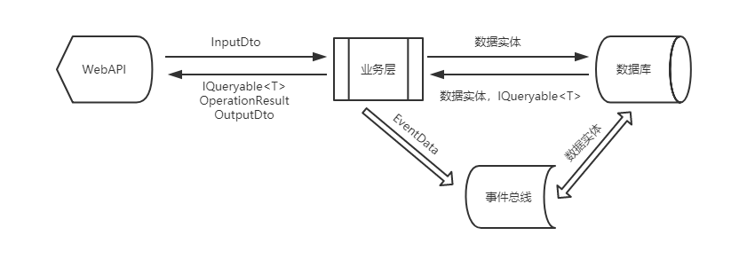

# 添加业务服务层
---
## 概述
一个模块的服务层，主要负责如下几个方面的工作：

* 向 API层 提供各个实体的数据查询的 `IQueryable<T>` 类型的数据源
* 接收 API层 传入的 `IInputDto` 参数，完成实体的 `新增`、`更新`、`删除` 等业务操作
* 接收 API层 传入的参数，处理各种 `模块级别` 的综合业务
* 处理完业务之后，将数据通过 数据仓储`IRepository` 更新到数据库
* 向 `事件总线` 模块发布业务处理事件，触发订阅的业务事件
* 向 API 层返回业务操作结果

整个过程如下图所示：
{.img-fluid tag=1}

## 服务层代码布局

### 服务层代码布局分析

一个业务模块，是负责完成一系列功能的，这些功能相互之间具有密切的关联性，所以对于一个模块来说，业务服务是一个整体，不应把他们再按单个实体拆分开来。
OSharp 的业务模块代码结构设计，也是根据这一原则来设计的。设计规则如下：

* 服务接口`IBlogsContract`：一个模块的业务服务共享一个服务接口，接口中包含模块的综合业务服务，也包含模块的各个实体的查询数据集、新增、更新、删除等自有业务服务。
* 服务实现`BlogsService`：服务实现使用 分部类`partial` 设计，例如本例中的博客模块业务，文件拆分如下：
    * `BlogsService.cs`：博客模块服务实现类的主文件，负责各实体的仓储服务注入，辅助服务注入，`模块综合业务`实现
    * `BlogsService.Blog.cs`：博客模块服务的`博客实体`服务实现类，负责博客实体的 `查询数据集、增改删` 业务实现
    * `BlogsService.Post.cs`：博客模块服务的`文章实体`服务实现类，负责文章实体的 `查询数据集、增改删` 业务实现

* 模块入口`BlogsPack`：定义模块的级别、启动顺序、执行服务添加、模块初始化等功能

综上，服务层代码布局如下所示：

```
src                                         # 源代码文件夹
└─Liuliu.Blogs.Core                         # 项目核心工程
   └─Blogs                                  # 博客模块文件夹
        ├─BlogsPack.cs                      # 博客模块入口类
        ├─BlogsService.cs                   # 博客服务类
        ├─BlogsService.Blog.cs              # 博客模块-博客服务类
        ├─BlogsService.Post.cs              # 博客模块-文章服务类
        ├─IBlogsContract.cs                 # 博客模块服务接口
        └─Events                            # 业务事件文件夹
            ├─VerifyBlogEventData.cs        # 审核博客事件数据
            └─VerifyBlogEventHandler.cs     # 审核博客事件处理器
```

## 服务接口 `IBlogsContract`

### 接口定义分析 

#### 数据查询

对于数据查询，业务层只向 API 层开放一个 `IQueryable<TEntity>` 的查询数据集。原则上，服务层不实现 `纯数据查询`（例如 用于列表分页数据、下拉菜单选项 等数据，不涉及数据变更的查询操作） 的服务，所有的 `纯数据查询` 都在 API层 按需要进行查询。具体分析请看 [>>数据查询应该在哪做>>](https://www.cnblogs.com/guomingfeng/p/mvc-ef-query.html#autoid-2-0-0)

额外的，`根据一定条件判断一个数据是否存在` 这种需求经常会用到（例如在新增或修改一个要求唯一的字符串时，需要异步检查输入的字符串是否已存在），因此设计一个 检查实体是否存在`CheckEntityExists` 的服务很有必要。

!!!node
    对于新增、更新、删除操作，除非很确定一次只操作一条记录除外，为了支持可能的批量操作，设计上都应把服务层的 增改删 操作设计为数组型参数的批量操作，同时使用 `params` 关键字使操作支持单个数据操作。

#### 数据变更

对于每一个实体，服务层按 `业务需求分析` 的要求定义必要的 `新增、更新、删除` 等操作，OSharp框架定义了一个 业务操作结果信息类 [OperationResult](https://docs.osharp.org/api/OSharp.Data.OperationResult.html) 来封装业务操作结果，这个结果可以返回 操作结果类型（`成功/错误/未变化/不存在/验证失败`）、返回消息、返回附加数据 等丰富的信息，API层 接受操作结果后可进行相应的处理。

### 博客模块的接口定义
回到我们的 `Liuliu.Blogs` 项目，根据 <[业务模块设计#服务层](index.md#_6)> 的需求分析，我们需要给 博客`Blog` 实体定义 `申请开通、开通审核、更新、删除` 服务，给 文章`Post` 实体类定义 `新增、更新、删除` 服务。

接口定义如下：
```C#

/// <summary>
/// 业务契约接口：博客模块
/// </summary>
public interface IBlogsContract
{
    #region 博客信息业务

    /// <summary>
    /// 获取 博客信息查询数据集
    /// </summary>
    IQueryable<Blog> Blogs { get; }

    /// <summary>
    /// 检查博客信息是否存在
    /// </summary>
    /// <param name="predicate">检查谓语表达式</param>
    /// <param name="id">更新的博客信息编号</param>
    /// <returns>博客信息是否存在</returns>
    Task<bool> CheckBlogExists(Expression<Func<Blog, bool>> predicate, int id = 0);

    /// <summary>
    /// 申请博客信息
    /// </summary>
    /// <param name="dto">申请博客信息DTO信息</param>
    /// <returns>业务操作结果</returns>
    Task<OperationResult> ApplyForBlog(BlogInputDto dto);

    /// <summary>
    /// 审核博客信息
    /// </summary>
    /// <param name="dto">审核博客信息DTO信息</param>
    /// <returns>业务操作结果</returns>
    Task<OperationResult> VerifyBlog(BlogVerifyDto dto);

    /// <summary>
    /// 更新博客信息
    /// </summary>
    /// <param name="dtos">包含更新信息的博客信息DTO信息</param>
    /// <returns>业务操作结果</returns>
    Task<OperationResult> UpdateBlogs(params BlogInputDto[] dtos);

    #endregion

    #region 文章信息业务

    /// <summary>
    /// 获取 文章信息查询数据集
    /// </summary>
    IQueryable<Post> Posts { get; }

    /// <summary>
    /// 检查文章信息是否存在
    /// </summary>
    /// <param name="predicate">检查谓语表达式</param>
    /// <param name="id">更新的文章信息编号</param>
    /// <returns>文章信息是否存在</returns>
    Task<bool> CheckPostExists(Expression<Func<Post, bool>> predicate, int id = 0);

    /// <summary>
    /// 添加文章信息
    /// </summary>
    /// <param name="dtos">要添加的文章信息DTO信息</param>
    /// <returns>业务操作结果</returns>
    Task<OperationResult> CreatePosts(params PostInputDto[] dtos);

    /// <summary>
    /// 更新文章信息
    /// </summary>
    /// <param name="dtos">包含更新信息的文章信息DTO信息</param>
    /// <returns>业务操作结果</returns>
    Task<OperationResult> UpdatePosts(params PostInputDto[] dtos);

    /// <summary>
    /// 删除文章信息
    /// </summary>
    /// <param name="ids">要删除的文章信息编号</param>
    /// <returns>业务操作结果</returns>
    Task<OperationResult> DeletePosts(params int[] ids);

    #endregion
}

```

## 服务实现 `BlogsService`

### 依赖服务注入方式分析

服务层的业务实现，通过向服务实现类注入 数据仓储`IRepository<TEntity, TKey>` 对象来获得向数据库存取数据的能力。根据 .NetCore 的依赖注入使用原则，常规的做法是在服务实现类的 `构造函数` 进行依赖服务的注入。形如：

```C#

/// <summary>
/// 业务服务实现：博客模块
/// </summary>
public class BlogsService : IBlogsContract
{
    private readonly IRepository<Blog, int> _blogRepository;
    private readonly IRepository<Post, int> _postRepository;
    private readonly IRepository<User, int> _userRepository;
    private readonly IRepository<Role, int> _roleRepository;
    private readonly IRepository<UserRole, Guid> _userRoleRepository;
    private readonly IEventBus _eventBus;

    /// <summary>
    /// 初始化一个<see cref="BlogsService"/>类型的新实例
    /// </summary>
    public BlogsService(IRepository<Blog, int> blogRepository,
        IRepository<Post, int> postRepository,
        IRepository<User, int> userRepository,
        IRepository<Role, int> roleRepository,
        IRepository<UserRole, Guid> userRoleRepository,
        IEventBus eventBus)
    {
        _blogRepository = blogRepository;
        _postRepository = postRepository;
        _userRepository = userRepository;
        _roleRepository = roleRepository;
        _userRoleRepository = userRoleRepository;
        _eventBus = eventBus;
    }
}

```
#### 构造函数注入带来的性能影响

每个仓储都使用构造函数注入的话，如果模块的业务比较复杂，涉及的实体比较多（比如十几个实体是很经常的事），就会造成每次实例化 `BlogsService` 类的实例的时候，都需要去实例化很多个依赖服务，而实际上 **一次业务执行只执行服务中的某个方法，可能也就用到其中的一两个依赖服务**，这就造成了很多不必要的额外工作，也就是性能损耗。

#### 依赖服务注入的性能优化

如果 **不考虑业务服务的可测试性**（单元测试通常需要Mock依赖服务）的话，在构造函数中只注入 `IServiceProvider` 实例，然后在业务代码中使用 `serviceProvider.GetService<T>()` 的方式来 **按需获取** 依赖服务的实例，是比较经济的方式。则服务实现变为如下所示：

```C#
/// <summary>
/// 业务服务实现：博客模块
/// </summary>
public class BlogsService : IBlogsContract
{
    private readonly IServiceProvider _serviceProvider;

    /// <summary>
    /// 初始化一个<see cref="BlogsService"/>类型的新实例
    /// </summary>
    public BlogsService(IServiceProvider serviceProvider)
    {
        _serviceProvider = serviceProvider;
    }

    /// <summary>
    /// 获取 博客仓储对象
    /// </summary>
    protected IRepository<Blog, int> BlogRepository => _serviceProvider.GetService<IRepository<Blog, int>>();

    /// <summary>
    /// 获取 文章仓储对象
    /// </summary>
    protected IRepository<Post, int> PostRepository => _serviceProvider.GetService<IRepository<Post, int>>();

    /// <summary>
    /// 获取 用户仓储对象
    /// </summary>
    protected IRepository<User, int> UserRepository => _serviceProvider.GetService<IRepository<User, int>>();

    /// <summary>
    /// 获取 角色仓储对象
    /// </summary>
    protected IRepository<Role, int> RoleRepository => _serviceProvider.GetService<IRepository<Role, int>>();

    /// <summary>
    /// 获取 角色仓储对象
    /// </summary>
    protected IRepository<UserRole, Guid> UserRoleRepository => _serviceProvider.GetService<IRepository<UserRole, Guid>>();

    /// <summary>
    /// 获取 事件总线对象
    /// </summary>
    protected IEventBus EventBus => _serviceProvider.GetService<IEventBus>();
}
```

各个依赖服务改为属性的存在方式，并且可访问性为 `protected`，这就保证了依赖服务的安全性。依赖服务使用 `serviceProvider.GetService<T>()` 的方式创建实例，可以做到 **按需创建**，达到性能优化的目的。

### 增改删操作的简化

#### 常规批量操作的弊端

直接通过 数据仓储`IRepository<TEntity, TKey>` 实现数据的增改删的批量操作，总免不了要使用循环来遍历传进来的多个InputDto，例如文章的更新操作，以下几个步骤是免不了的：

1. 由 `dto.Id` 查找出相应的文章实体 `entity`，如果不存在，中止操作并返回
2. 进行更新前的数据检查
    1. 检查 dto 的合法性，比如文章标题要求唯一，dto.Title 就要验证唯一性，中止操作并返回
    2. 检查 entity 的合法性，比如文章已锁定，就不允许编辑，要进行拦截，检查不通过，中止操作并返回
3. 使用 `AutoMapper` 将 `dto` 的值更新到 `entity`
4. 进行其他关联实体的更新
    1. 比如添加文章的编辑记录
    2. 比如给当前操作人加积分
5. 将 `entity` 的更新提交到数据库

整个过程实现代码如下：

```C#
/// <summary>
/// 更新文章信息
/// </summary>
/// <param name="dtos">包含更新信息的文章信息DTO信息</param>
/// <returns>业务操作结果</returns>
public virtual async Task<OperationResult> UpdatePosts(params PostInputDto[] dtos)
{
    Check.Validate<PostInputDto, int>(dtos, nameof(dtos));

    int count = 0;
    foreach (PostInputDto dto in dtos)
    {
        Post entity = await PostRepository.GetAsync(dto.Id);
        if (entity == null)
        {
            return new OperationResult(OperationResultType.QueryNull, $"编号为{dto.Id}的文章信息无法找到");
        }

        // todo:
        // 在这里要检查 dto 的合法性，比如文章标题要求唯一，dto.Title 就要验证唯一性
        // 在这里要检查 entity 的合法性，比如文章已锁定，就不允许编辑，要进行拦截

        entity = dto.MapTo(entity);

        // todo:
        // 在这里要进行其他实体的关联更新，比如添加文章的编辑记录

        count += await PostRepository.UpdateAsync(entity);
    }

    if (count > 0)
    {
        return new OperationResult(OperationResultType.Success, $"{dtos.Length}个文章信息更新成功");
    }
    return OperationResult.NoChanged;
}

```

#### 批量操作改进

这是个重复性很大的繁琐工作，整个流程中只有第2步和第4步是变化的，其余步骤都相对固定。为了简化这类操作，我们可以将第2、4步骤变化点封装起来，使用 `委托` 将操作内容作为参数传进来。
OSharp在 数据仓储`IRepository<TEntity, TKey>` 中定义了关于这类 `IInputDto` 类型参数的实体批量操作API。

例如批量更新，实现如下：
```C# hl_lines="23 24 25 26 28 29 30 31"
/// <summary>
/// 异步以DTO为载体批量更新实体
/// </summary>
/// <typeparam name="TEditDto">更新DTO类型</typeparam>
/// <param name="dtos">更新DTO信息集合</param>
/// <param name="checkAction">更新信息合法性检查委托</param>
/// <param name="updateFunc">由DTO到实体的转换委托</param>
/// <returns>业务操作结果</returns>
public virtual async Task<OperationResult> UpdateAsync<TEditDto>(ICollection<TEditDto> dtos,
    Func<TEditDto, TEntity, Task> checkAction = null,
    Func<TEditDto, TEntity, Task<TEntity>> updateFunc = null) where TEditDto : IInputDto<TKey>
{
    List<string> names = new List<string>();
    foreach (TEditDto dto in dtos)
    {
        try
        {
            TEntity entity = await _dbSet.FindAsync(dto.Id);
            if (entity == null)
            {
                return new OperationResult(OperationResultType.QueryNull);
            }
            if (checkAction != null)
            {
                await checkAction(dto, entity);
            }
            entity = dto.MapTo(entity);
            if (updateFunc != null)
            {
                entity = await updateFunc(dto, entity);
            }
            entity = CheckUpdate(entity)[0];
            _dbContext.Update<TEntity, TKey>(entity);
        }
        catch (OsharpException e)
        {
            return new OperationResult(OperationResultType.Error, e.Message);
        }
        catch (Exception e)
        {
            _logger.LogError(e, e.Message);
            return new OperationResult(OperationResultType.Error, e.Message);
        }
        names.AddIfNotNull(GetNameValue(dto));
    }
    int count = await _dbContext.SaveChangesAsync(_cancellationTokenProvider.Token);
    return count > 0
        ? new OperationResult(OperationResultType.Success,
            names.Count > 0
                ? "信息“{0}”更新成功".FormatWith(names.ExpandAndToString())
                : "{0}个信息更新成功".FormatWith(dtos.Count))
        : new OperationResult(OperationResultType.NoChanged);
}
```
如上高亮代码，此方法定义了 `Func<TEditDto, TEntity, Task> checkAction` 和 `Func<TEditDto, TEntity, Task<TEntity>> updateFunc` 两个委托参数作为 `更新前参数检查` 和 `更新后关联更新` 的操作传入方式，方法中是以 `OsharpException` 类型异常来作为中止信号的，如果需要在委托中中止操作，直接抛 `OsharpException` 异常即可。在调用时，即可极大简化批量更新的操作，如上的更新代码，简化如下：
```C#
/// <summary>
/// 更新文章信息
/// </summary>
/// <param name="dtos">包含更新信息的文章信息DTO信息</param>
/// <returns>业务操作结果</returns>
public virtual async Task<OperationResult> UpdatePosts(params PostInputDto[] dtos)
{
    Check.Validate<PostInputDto, int>(dtos, nameof(dtos));

    return await PostRepository.UpdateAsync(dtos, async (dto, entity) =>
        {
            // todo:
            // 在这里要检查 dto 的合法性，比如文章标题要求唯一，dto.Title 就要验证唯一性
            // 在这里要检查 entity 的合法性，比如文章已锁定，就不允许编辑，要进行拦截
        },
        async (dto, entity) =>
        {
            // todo:
            // 在这里要进行其他实体的关联更新，比如添加文章的编辑记录

            return entity;
        });
}
```

如果没有必要做额外的 更新前检查 和更新后的 关联更新，上面的批量更新可以简化到极致：
```C#
/// <summary>
/// 更新文章信息
/// </summary>
/// <param name="dtos">包含更新信息的文章信息DTO信息</param>
/// <returns>业务操作结果</returns>
public virtual async Task<OperationResult> UpdatePosts(params PostInputDto[] dtos)
{
    Check.Validate<PostInputDto, int>(dtos, nameof(dtos));

    return await PostRepository.UpdateAsync(dtos);
}
```

### 服务层的事务管理

#### 事务开启与重用
OSharp的数据层在一次业务处理请求中遇到数据的 `新增、更新、删除` 操作并第一次执行 `SaveChanges` 操作时，会自动开启手动事务，以后再次执行 `SaveChanges` 操作时，会直接使用 **同一连接对象** 的现有事务，以保证一次业务请求的操作都自在一个事务内。
``` C# hl_lines="6"
public override int SaveChanges()
{
    // ...

    //开启或使用现有事务
    BeginOrUseTransaction();

    int count = base.SaveChanges();
    
    // ...

    return count;
}
```
#### 事务提交

为了方便事务管理和不同的服务层之间的事务同步，OSharp框架默认的事务提交是在 API 层通过 MVC 的 `[UnitOfWorkAttribute](https://docs.osharp.org/api/OSharp.AspNetCore.Mvc.Filters.UnitOfWorkAttribute.html)` 特性来提交的。

```C# hl_lines="7"
/// <summary>
/// 新用户注册
/// </summary>
/// <param name="dto">注册信息</param>
/// <returns>JSON操作结果</returns>
[HttpPost]
[ServiceFilter(typeof(UnitOfWorkAttribute))]
[ModuleInfo]
[Description("用户注册")]
public async Task<AjaxResult> Register(RegisterDto dto)
{
    // ...
}
```

当然，你也可以不在 API 层标注 `[UnitOfWorkAttribute]`，而是在需要的时候通过 `IUnitOfWork.Commit()` 手动提交事务
```C#
IUnitOfWork unitOfWork = HttpContext.RequestServices.GetUnitOfWork<User, int>();
unitOfWork.Commit();
```

### 业务服务事件订阅与发布

业务服务事件，是通过 事件总线`EventBus` 来实现的，OSharp构建了一个简单的事件总线基础建设，可以很方便地订阅和发布业务事件。

#### 订阅事件
订阅事件很简单，只需要定义一组配套的 事件数据`EventData` 和相应的 事件处理器`EventHandler`，即可完成事件订阅的工作。

##### IEventData
事件数据`EventData` 是业务服务发布事件时向事件总线传递的数据，每一种业务，都有特定的事件数据，一个事件数据可触发多个事件处理器
定义一个事件数据，需要实现 `IEventData` 接口
```C# 
/// <summary>
/// 定义事件数据，所有事件都要实现该接口
/// </summary>
public interface IEventData
{
    /// <summary>
    /// 获取 事件编号
    /// </summary>
    Guid Id { get; }

    /// <summary>
    /// 获取 事件发生的时间
    /// </summary>
    DateTime EventTime { get; }

    /// <summary>
    /// 获取或设置 事件源，触发事件的对象
    /// </summary>
    object EventSource { get; set; }
}
```

##### EventDataBase

为了方便 事件数据 的定义，OSharp定义了一个通用事件数据基类`EventDataBase`，继承此基类，只需要添加事件触发需要的业务数据即可
```C#
/// <summary>
/// 事件源数据信息基类
/// </summary>
public abstract class EventDataBase : IEventData
{
    /// <summary>
    /// 初始化一个<see cref="EventDataBase"/>类型的新实例
    /// </summary>
    protected EventDataBase()
    {
        Id = Guid.NewGuid();
        EventTime = DateTime.Now;
    }

    /// <summary>
    /// 获取 事件编号
    /// </summary>
    public Guid Id { get; }

    /// <summary>
    /// 获取 事件发生时间
    /// </summary>
    public DateTime EventTime { get; }

    /// <summary>
    /// 获取或设置 触发事件的对象
    /// </summary>
    public object EventSource { get; set; }
}
```

##### IEventHandler

业务事件的处理逻辑，是通过 事件处理器 `EventHandler` 来实现的，事件处理器应遵从 `单一职责` 原则，一个处理器只做一件事，业务服务层发布一项 事件数据，可触发多个 事件处理器
```C#
/// <summary>
/// 定义事件处理器，所有事件处理都要实现该接口
/// EventBus中，Handler的调用是同步执行的，如果需要触发就不管的异步执行，可以在实现EventHandler的Handle逻辑时使用Task.Run
/// </summary>
[IgnoreDependency]
public interface IEventHandler
{
    /// <summary>
    /// 是否可处理指定事件
    /// </summary>
    /// <param name="eventData">事件源数据</param>
    /// <returns>是否可处理</returns>
    bool CanHandle(IEventData eventData);

    /// <summary>
    /// 事件处理
    /// </summary>
    /// <param name="eventData">事件源数据</param>
    void Handle(IEventData eventData);

    /// <summary>
    /// 异步事件处理
    /// </summary>
    /// <param name="eventData">事件源数据</param>
    /// <param name="cancelToken">异步取消标识</param>
    /// <returns></returns>
    Task HandleAsync(IEventData eventData, CancellationToken cancelToken = default(CancellationToken));
}


/// <summary>
/// 定义泛型事件处理器
/// EventBus中，Handler的调用是同步执行的，如果需要触发就不管的异步执行，可以在实现EventHandler的Handle逻辑时使用Task.Run
/// </summary>
/// <typeparam name="TEventData">事件源数据</typeparam>
[IgnoreDependency]
public interface IEventHandler<in TEventData> : IEventHandler where TEventData : IEventData
{
    /// <summary>
    /// 事件处理
    /// </summary>
    /// <param name="eventData">事件源数据</param>
    void Handle(TEventData eventData);

    /// <summary>
    /// 异步事件处理
    /// </summary>
    /// <param name="eventData">事件源数据</param>
    /// <param name="cancelToken">异步取消标识</param>
    Task HandleAsync(TEventData eventData, CancellationToken cancelToken = default(CancellationToken));
}
```

##### EventHandlerBase
同样的，为了方便 事件处理器 的定义，OSharp定义了一个通用的事件处理器基类`EventHandlerBase<TEventData>`，继承此基类，只需要实现核心的事件处理逻辑即可
```C#
/// <summary>
/// 事件处理器基类
/// </summary>
public abstract class EventHandlerBase<TEventData> : IEventHandler<TEventData> where TEventData : IEventData
{
    /// <summary>
    /// 是否可处理指定事件
    /// </summary>
    /// <param name="eventData">事件源数据</param>
    /// <returns>是否可处理</returns>
    public virtual bool CanHandle(IEventData eventData)
    {
        return eventData.GetType() == typeof(TEventData);
    }

    /// <summary>
    /// 事件处理
    /// </summary>
    /// <param name="eventData">事件源数据</param>
    public virtual void Handle(IEventData eventData)
    {
        if (!CanHandle(eventData))
        {
            return;
        }
        Handle((TEventData)eventData);
    }

    /// <summary>
    /// 异步事件处理
    /// </summary>
    /// <param name="eventData">事件源数据</param>
    /// <param name="cancelToken">异步取消标识</param>
    /// <returns></returns>
    public virtual Task HandleAsync(IEventData eventData, CancellationToken cancelToken = default(CancellationToken))
    {
        if (!CanHandle(eventData))
        {
            return Task.FromResult(0);
        }
        return HandleAsync((TEventData)eventData, cancelToken);
    }

    /// <summary>
    /// 事件处理
    /// </summary>
    /// <param name="eventData">事件源数据</param>
    public abstract void Handle(TEventData eventData);

    /// <summary>
    /// 异步事件处理
    /// </summary>
    /// <param name="eventData">事件源数据</param>
    /// <param name="cancelToken">异步取消标识</param>
    /// <returns>是否成功</returns>
    public virtual Task HandleAsync(TEventData eventData, CancellationToken cancelToken = default(CancellationToken))
    {
        return Task.Run(() => Handle(eventData), cancelToken);
    }
}
```

#### 发布事件
事件的发布，就相当简单了，只需要实例化一个事件数据`EventData`的实例，然后通过`IEventBus.Publish(eventData)`即可发布事件，触发该`EventData`的所有订阅处理器

```C#
XXXEventData eventData = new XXXEventData()
{
    // ...
};
EventBus.Publish(eventData);

```

#### 博客模块的业务事件实现

回到我们的 `Liuliu.Blogs` 项目，根据 <[业务模块设计#博客业务需求分析](index.md#_4)> 的需求分析的第二条，审核博客之后需要发邮件通知用户，发邮件属于审核博客业务计划外的需求，使用 业务事件 来实现正当其时。

* 审核博客业务事件数据
```C#
/// <summary>
/// 审核博客事件数据
/// </summary>
public class VerifyBlogEventData : EventDataBase
{
    /// <summary>
    /// 获取或设置 博客名称
    /// </summary>
    public string BlogName { get; set; }

    /// <summary>
    /// 获取或设置 用户名
    /// </summary>
    public string UserName { get; set; }

    /// <summary>
    /// 获取或设置 审核是否通过
    /// </summary>
    public bool IsEnabled { get; set; }

    /// <summary>
    /// 获取或设置 审核理由
    /// </summary>
    public string Reason { get; set; }
}
```

* 审核博客业务事件处理器
```C#
/// <summary>
/// 审核博客事件处理器
/// </summary>
public class VerifyBlogEventHandler : EventHandlerBase<VerifyBlogEventData>
{
    private readonly ILogger _logger;

    /// <summary>
    /// 初始化一个<see cref="VerifyBlogEventHandler"/>类型的新实例
    /// </summary>
    public VerifyBlogEventHandler(IServiceProvider serviceProvider)
    {
        _logger = serviceProvider.GetService<ILoggerFactory>().CreateLogger<VerifyBlogEventHandler>();
    }

    /// <summary>事件处理</summary>
    /// <param name="eventData">事件源数据</param>
    public override void Handle(VerifyBlogEventData eventData)
    {
        _logger.LogInformation(
            $"触发 审核博客事件处理器，用户“{eventData.UserName}”的博客“{eventData.BlogName}”审核结果：{(eventData.IsEnabled ? "通过" : "未通过")}，审核理由：{eventData.Reason}");
    }
}
```

### 博客模块的服务实现
回到我们的 `Liuliu.Blogs` 项目，根据 <[业务模块设计#服务层](index.md#_6)> 的需求分析，综合使用OSharp框架提供的基础建设，博客模块的业务服务实现如下：

#### BlogsService.cs
```C#
/// <summary>
/// 业务服务实现：博客模块
/// </summary>
public partial class BlogsService : IBlogsContract
{
    private readonly IServiceProvider _serviceProvider;

    /// <summary>
    /// 初始化一个<see cref="BlogsService"/>类型的新实例
    /// </summary>
    public BlogsService(IServiceProvider serviceProvider)
    {
        _serviceProvider = serviceProvider;
    }

    /// <summary>
    /// 获取 博客仓储对象
    /// </summary>
    protected IRepository<Blog, int> BlogRepository => _serviceProvider.GetService<IRepository<Blog, int>>();

    /// <summary>
    /// 获取 文章仓储对象
    /// </summary>
    protected IRepository<Post, int> PostRepository => _serviceProvider.GetService<IRepository<Post, int>>();

    /// <summary>
    /// 获取 用户仓储对象
    /// </summary>
    protected IRepository<User, int> UserRepository => _serviceProvider.GetService<IRepository<User, int>>();
}
```

#### BlogsService.Blog.cs
``` C#
public partial class BlogsService
{
    /// <summary>
    /// 获取 博客信息查询数据集
    /// </summary>
    public virtual IQueryable<Blog> Blogs => BlogRepository.Query();

    /// <summary>
    /// 检查博客信息是否存在
    /// </summary>
    /// <param name="predicate">检查谓语表达式</param>
    /// <param name="id">更新的博客信息编号</param>
    /// <returns>博客信息是否存在</returns>
    public virtual Task<bool> CheckBlogExists(Expression<Func<Blog, bool>> predicate, int id = 0)
    {
        Check.NotNull(predicate, nameof(predicate));
        return BlogRepository.CheckExistsAsync(predicate, id);
    }

    /// <summary>
    /// 申请博客信息
    /// </summary>
    /// <param name="dto">申请博客信息DTO信息</param>
    /// <returns>业务操作结果</returns>
    public virtual async Task<OperationResult> ApplyForBlog(BlogInputDto dto)
    {
        Check.Validate(dto, nameof(dto));

        // 博客是以当前用户的身份来申请的
        ClaimsPrincipal principal = _serviceProvider.GetCurrentUser();
        if (principal == null || !principal.Identity.IsAuthenticated)
        {
            return new OperationResult(OperationResultType.Error, "用户未登录或登录已失效");
        }

        int userId = principal.Identity.GetUserId<int>();
        User user = await UserRepository.GetAsync(userId);
        if (user == null)
        {
            return new OperationResult(OperationResultType.QueryNull, $"编号为“{userId}”的用户信息不存在");
        }
        Blog blog = BlogRepository.TrackQuery(m => m.UserId == userId).FirstOrDefault();
        if (blog != null)
        {
            return new OperationResult(OperationResultType.Error, "当前用户已开通博客，不能重复申请");
        }

        if (await CheckBlogExists(m => m.Url == dto.Url))
        {
            return new OperationResult(OperationResultType.Error, $"Url 为“{dto.Url}”的博客已存在，不能重复添加");
        }
        blog = dto.MapTo<Blog>();
        blog.UserId = userId;
        int count = await BlogRepository.InsertAsync(blog);
        return count > 0
            ? new OperationResult(OperationResultType.Success, "博客申请成功")
            : OperationResult.NoChanged;
    }

    /// <summary>
    /// 审核博客信息
    /// </summary>
    /// <param name="dto">审核博客信息DTO信息</param>
    /// <returns>业务操作结果</returns>
    public virtual async Task<OperationResult> VerifyBlog(BlogVerifyDto dto)
    {
        Check.Validate(dto, nameof(dto));
        
        Blog blog = await BlogRepository.GetAsync(dto.Id);
        if (blog == null)
        {
            return new OperationResult(OperationResultType.QueryNull, $"编号为“{dto.Id}”的博客信息不存在");
        }

        // 更新博客
        blog.IsEnabled = dto.IsEnabled;
        int count = await BlogRepository.UpdateAsync(blog);

        User user = await UserRepository.GetAsync(blog.UserId);
        if (user == null)
        {
            return new OperationResult(OperationResultType.QueryNull, $"编号为“{blog.UserId}”的用户信息不存在");
        }

        // 如果开通博客，给用户开通博主身份
        if (dto.IsEnabled)
        {
            // 查找博客主的角色，博主角色名可由配置系统获得
            const string roleName = "博主";
            // 用于CUD操作的实体，要用 TrackQuery 方法来查询出需要的数据，不能用 Query，因为 Query 会使用 AsNoTracking
            Role role = RoleRepository.TrackQuery(m => m.Name == roleName).FirstOrDefault();
            if (role == null)
            {
                return new OperationResult(OperationResultType.QueryNull, $"名称为“{roleName}”的角色信息不存在");
            }

            UserRole userRole = UserRoleRepository.TrackQuery(m => m.UserId == user.Id && m.RoleId == role.Id)
                .FirstOrDefault();
            if (userRole == null)
            {
                userRole = new UserRole() { UserId = user.Id, RoleId = role.Id, IsLocked = false };
                count += await UserRoleRepository.InsertAsync(userRole);
            }
        }

        OperationResult result = count > 0
            ? new OperationResult(OperationResultType.Success, $"博客“{blog.Display}”审核 {(dto.IsEnabled ? "通过" : "未通过")}，审核理由：{dto.Reason}")
            : OperationResult.NoChanged;
        if (result.Succeeded)
        {
            VerifyBlogEventData eventData = new VerifyBlogEventData()
            {
                BlogName = blog.Display,
                UserName = user.NickName,
                IsEnabled = blog.IsEnabled,
                Reason = dto.Reason
            };
            EventBus.Publish(eventData);
        }

        return result;
    }

    /// <summary>
    /// 更新博客信息
    /// </summary>
    /// <param name="dtos">包含更新信息的博客信息DTO信息</param>
    /// <returns>业务操作结果</returns>
    public virtual Task<OperationResult> UpdateBlogs(params BlogInputDto[] dtos)
    {
        Check.Validate<BlogInputDto, int>(dtos, nameof(dtos) );

        return BlogRepository.UpdateAsync(dtos, async (dto, entity) =>
        {
            if (await BlogRepository.CheckExistsAsync(m => m.Url == dto.Url, dto.Id))
            {
                throw new OsharpException($"Url为“{dto.Url}”的博客已存在，不能重复");
            }
        });
    }
}
```

#### BlogsService.Post.cs
```C#
public partial class BlogsService
{
    /// <summary>
    /// 获取 文章信息查询数据集
    /// </summary>
    public virtual IQueryable<Post> Posts => PostRepository.Query();

    /// <summary>
    /// 检查文章信息是否存在
    /// </summary>
    /// <param name="predicate">检查谓语表达式</param>
    /// <param name="id">更新的文章信息编号</param>
    /// <returns>文章信息是否存在</returns>
    public virtual Task<bool> CheckPostExists(Expression<Func<Post, bool>> predicate, int id = 0)
    {
        Check.NotNull(predicate, nameof(predicate));
        return PostRepository.CheckExistsAsync(predicate, id);
    }

    /// <summary>
    /// 添加文章信息
    /// </summary>
    /// <param name="dtos">要添加的文章信息DTO信息</param>
    /// <returns>业务操作结果</returns>
    public virtual async Task<OperationResult> CreatePosts(params PostInputDto[] dtos)
    {
        Check.Validate<PostInputDto, int>(dtos, nameof(dtos));
        if (dtos.Length == 0)
        {
            return OperationResult.NoChanged;
        }

        // 文章是以当前用户身份来添加的
        ClaimsPrincipal principal = _serviceProvider.GetCurrentUser();
        if (principal == null || !principal.Identity.IsAuthenticated)
        {
            throw new OsharpException("用户未登录或登录已失效");
        }
        // 检查当前用户的博客状态
        int userId = principal.Identity.GetUserId<int>();
        Blog blog = BlogRepository.TrackQuery(m => m.UserId == userId).FirstOrDefault();
        if (blog == null || !blog.IsEnabled)
        {
            throw new OsharpException("当前用户的博客未开通，无法添加文章");
        }

        // 没有前置检查，checkAction为null
        return await PostRepository.InsertAsync(dtos, null, (dto, entity) =>
        {
            // 给新建的文章关联博客和作者
            entity.BlogId = blog.Id;
            entity.UserId = userId;
            return Task.FromResult(entity);
        });
    }

    /// <summary>
    /// 更新文章信息
    /// </summary>
    /// <param name="dtos">包含更新信息的文章信息DTO信息</param>
    /// <returns>业务操作结果</returns>
    public virtual Task<OperationResult> UpdatePosts(params PostInputDto[] dtos)
    {
        Check.Validate<PostInputDto, int>(dtos, nameof(dtos));

        return PostRepository.UpdateAsync(dtos);
    }

    /// <summary>
    /// 删除文章信息
    /// </summary>
    /// <param name="ids">要删除的文章信息编号</param>
    /// <returns>业务操作结果</returns>
    public virtual Task<OperationResult> DeletePosts(params int[] ids)
    {
        Check.NotNull(ids, nameof(ids));
        return PostRepository.DeleteAsync(ids);
    }
}

```

## 模块入口 `BlogsPack`

### 模块入口基类

#### 非AspNetCore模块基类 OsharpPack

前面多次提到，每个Pack模块都是继承自一个 模块基类`OsharpPack`，这个基类用于定义 模块初始化`UsePack` 过程中未涉及 `AspNetCore` 环境的模块。
```C#
/// <summary>
/// OSharp模块基类
/// </summary>
public abstract class OsharpPack
{
    /// <summary>
    /// 获取 模块级别，级别越小越先启动
    /// </summary>
    public virtual PackLevel Level => PackLevel.Business;

    /// <summary>
    /// 获取 模块启动顺序，模块启动的顺序先按级别启动，同一级别内部再按此顺序启动，
    /// 级别默认为0，表示无依赖，需要在同级别有依赖顺序的时候，再重写为>0的顺序值
    /// </summary>
    public virtual int Order => 0;

    /// <summary>
    /// 获取 是否已可用
    /// </summary>
    public bool IsEnabled { get; protected set; }

    /// <summary>
    /// 将模块服务添加到依赖注入服务容器中
    /// </summary>
    /// <param name="services">依赖注入服务容器</param>
    /// <returns></returns>
    public virtual IServiceCollection AddServices(IServiceCollection services)
    {
        return services;
    }

    /// <summary>
    /// 应用模块服务
    /// </summary>
    /// <param name="provider">服务提供者</param>
    public virtual void UsePack(IServiceProvider provider)
    {
        IsEnabled = true;
    }

    /// <summary>
    /// 获取当前模块的依赖模块类型
    /// </summary>
    /// <returns></returns>
    internal Type[] GetDependPackTypes(Type packType = null)
    {
        // ...
    }
}
```

模块基类`OsharpPack` 定义了两个可重写属性：

* `PackLevel`：模块级别，级别越小越先启动
模块级别按 模块 在框架中不同的功能层次，定义了如下几个级别：
```C#
/// <summary>
/// 模块级别，级别越核心，优先启动
/// </summary>
public enum PackLevel
{
    /// <summary>
    /// 核心级别，表示系统的核心模块，
    /// 这些模块不涉及第三方组件，在系统运行中是不可替换的，核心模块将始终加载
    /// </summary>
    Core = 1,
    /// <summary>
    /// 框架级别，表示涉及第三方组件的基础模块
    /// </summary>
    Framework = 10,
    /// <summary>
    /// 应用级别，表示涉及应用数据的基础模块
    /// </summary>
    Application = 20,
    /// <summary>
    /// 业务级别，表示涉及真实业务处理的模块
    /// </summary>
    Business = 30
}
```
* `Order`：级别内模块启动顺序，模块启动的顺序先按级别启动，同一级别内部再按此顺序启动，级别默认为 0，表示无依赖，需要在同级别有依赖顺序的时候，再重写为 >0 的顺序值

同时，模块基类 还定义了两个方法：

* `AddServices`：用于将模块内定义的服务注入到 **依赖注入服务容器** 中。
* `UsePack`：用于使用服务对当前模块进行初始化。

#### AspNetCore模块基类 AspOsharpPack

`AspOsharpPack` 基类继承了 `OsharpPack`，添加了一个对 `IApplicationBuilder` 支持的 `UsePack` 方法，用于实现与 `AspNetCore` 关联的模块初始化工作，例如 Mvc模块 初始化的时候需要应用中间件：`app.UseMvcWithAreaRoute();`

```C#
/// <summary>
///  基于AspNetCore环境的Pack模块基类
/// </summary>
public abstract class AspOsharpPack : OsharpPack
{
    /// <summary>
    /// 应用AspNetCore的服务业务
    /// </summary>
    /// <param name="app">Asp应用程序构建器</param>
    public virtual void UsePack(IApplicationBuilder app)
    {
        base.UsePack(app.ApplicationServices);
    }
}
```

### 博客模块的模块入口实现
回到我们的 `Liuliu.Blogs` 项目，我们来实现投票模块的模块入口类 `BlogsPack`：

* 博客模块属于业务模块，因此 `PackLevel` 设置为 `Business`
* 博客模块的启动顺序无需重写，保持 0 即可
* 将 博客业务服务 注册到 服务容器中
* 无甚初始化业务

实现代码如下：
```C#
/// <summary>
/// 博客模块
/// </summary>
public class BlogsPack : OsharpPack
{
    /// <summary>
    /// 获取 模块级别，级别越小越先启动
    /// </summary>
    public override PackLevel Level { get; } = PackLevel.Business;

    /// <summary>将模块服务添加到依赖注入服务容器中</summary>
    /// <param name="services">依赖注入服务容器</param>
    /// <returns></returns>
    public override IServiceCollection AddServices(IServiceCollection services)
    {
        services.TryAddScoped<IBlogsContract, BlogsService>();

        return services;
    }
}
```
至此，博客模块的服务层实现完毕。